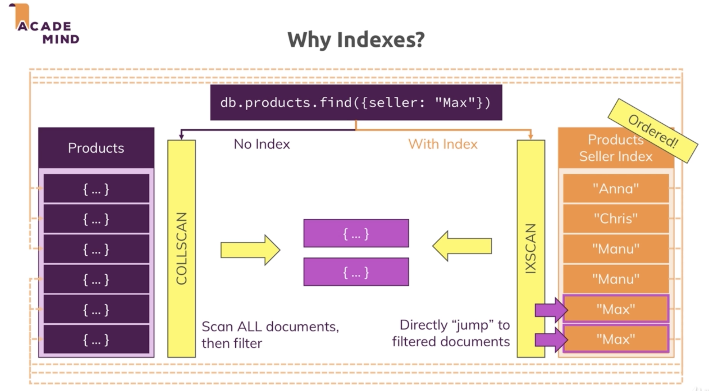
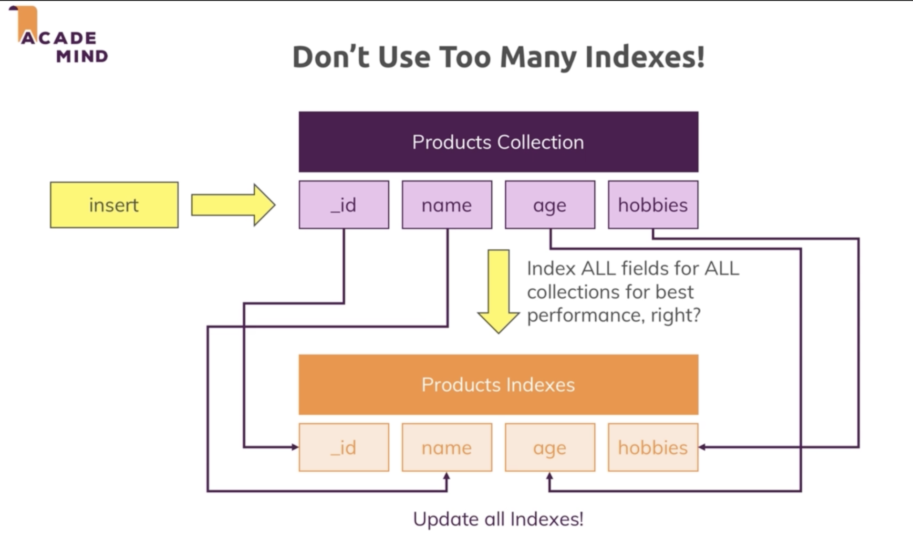
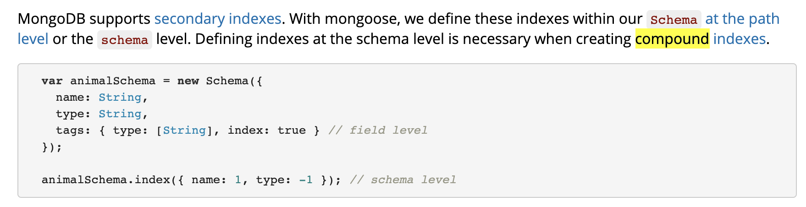

# 10 WORKING WITH INDEXES

- [x] [1. Why indexes](#1)
- [x] [2. Adding a Single Field Index](#2)
- [x] [3. Mongo command](#3)
- [x] [4. Tool to analyze](#4) 'COLLSCAN' collection scan vs 'IXSCAN' index scan
- [x] [5. Create Index](#5)
- [x] [6. Drop Index](#6)
- [x] [7. Creating Compound Index](#7)
- [x] [8. Using Indexes for sorting](#8)
- [x] [9. Configuring Indexes](#9)
- [x] [10. Partial Filters](#10)
- [x] [11. What difference between Partial index and Compound index](#11)
- [x] [12. Combination of unique and partial filter expression](#12)
- [ ] [13. Time-To-Live (TTL) index](#13)

---

## 1. Why indexes

> Why do we use Indexes



<br/>

> Don't Use Too Many Indexes

Because when we add a new document, we also have to add a new element to the index.



---

## <a name="2">2. Adding a Single Field Index</a>

1.connect mongo-local-db

Terminal-1

```
> mongod --dbpath /usr/local/var
```

2.Add data from file persons.json to mongo-local-db db name contactData document name contacts run command at the root project directory

Terminal-2

```
> mongoimport persons.json -d contactData -c contacts --jsonArray
```

---

## <a name="3">3. Mongo command</a>

> Mongo command (after 1,2) at Terminal-3 run command `mongo`

1. `show dbs`

Terminal-3

```
> mongo
> show dbs
admin        0.000GB
config       0.000GB
contactData  0.003GB
local        0.000GB
>
```

2. `use contactData`

```
> show dbs
admin        0.000GB
config       0.000GB
contactData  0.003GB
local        0.000GB
> use contactData
switched to db contactData
>
```

3. `show collections`

```
> show dbs
admin        0.000GB
config       0.000GB
contactData  0.003GB
local        0.000GB
> use contactData
switched to db contactData
> show collections
contacts
>
```

4. findOne `db.contacts.findOne()` return random data

```JSON
> db.contacts.findOne()
{
	"_id" : ObjectId("5e0c6b63b9525e53802ea74e"),
	"gender" : "male",
	"name" : {
		"title" : "mr",
		"first" : "victor",
		"last" : "pedersen"
	},
	"location" : {
		"street" : "2156 stenbjergvej",
		"city" : "billum",
		"state" : "nordjylland",
		"postcode" : 56649,
		"coordinates" : {
			"latitude" : "-29.8113",
			"longitude" : "-31.0208"
		},
		"timezone" : {
			"offset" : "+5:30",
			"description" : "Bombay, Calcutta, Madras, New Delhi"
		}
	},
	"email" : "victor.pedersen@example.com",
	"login" : {
		"uuid" : "fbb3c298-2cea-4415-84d1-74233525c325",
		"username" : "smallbutterfly536",
		"password" : "down",
		"salt" : "iW5QrgwW",
		"md5" : "3cc8b8a4d69321a408cd46174e163594",
		"sha1" : "681c0353b34fae08422686eea190e1c09472fc1f",
		"sha256" : "eb5251e929c56dfd19fc597123ed6ec2d0130a2c3c1bf8fc9c2ff8f29830a3b7"
	},
	"dob" : {
		"date" : "1959-02-19T23:56:23Z",
		"age" : 59
	},
	"registered" : {
		"date" : "2004-07-07T22:37:39Z",
		"age" : 14
	},
	"phone" : "23138213",
	"cell" : "30393606",
	"id" : {
		"name" : "CPR",
		"value" : "506102-2208"
	},
	"picture" : {
		"large" : "https://randomuser.me/api/portraits/men/23.jpg",
		"medium" : "https://randomuser.me/api/portraits/med/men/23.jpg",
		"thumbnail" : "https://randomuser.me/api/portraits/thumb/men/23.jpg"
	},
	"nat" : "DK"
}
>
```

5. run a query and let's find all people who are older than 60 `db.contacts.findOne({"dob.age": {$gt: 60}})`

```JSON
> db.contacts.findOne({"dob.age": {$gt: 60}})
{
	"_id" : ObjectId("5e0c6b63b9525e53802ea755"),
	"gender" : "female",
	"name" : {
		"title" : "mrs",
		"first" : "madeleine",
		"last" : "till"
	},
	"location" : {
		"street" : "im winkel 166",
		"city" : "villingen-schwenningen",
		"state" : "baden-württemberg",
		"postcode" : 32227,
		"coordinates" : {
			"latitude" : "83.3998",
			"longitude" : "-172.3753"
		},
		"timezone" : {
			"offset" : "+5:30",
			"description" : "Bombay, Calcutta, Madras, New Delhi"
		}
	},
	"email" : "madeleine.till@example.com",
	"login" : {
		"uuid" : "e70766b6-9d4f-419f-85c5-efc3c42db023",
		"username" : "goldencat450",
		"password" : "panthers",
		"salt" : "mHOsDM43",
		"md5" : "a97539f5d7b6c7302d3f3c1dd1d389b5",
		"sha1" : "a991dd190a83856b04d41a5e64bc41b5728b6903",
		"sha256" : "bd123b2b2aae61c6e8d3449bb14c6a032b4860275da781f8ffc73f5500e667bd"
	},
	"dob" : {
		"date" : "1954-05-01T02:34:40Z",
		"age" : 64
	},
	"registered" : {
		"date" : "2008-06-14T03:14:37Z",
		"age" : 10
	},
	"phone" : "0209-9573743",
	"cell" : "0173-1226290",
	"id" : {
		"name" : "",
		"value" : null
	},
	"picture" : {
		"large" : "https://randomuser.me/api/portraits/women/27.jpg",
		"medium" : "https://randomuser.me/api/portraits/med/women/27.jpg",
		"thumbnail" : "https://randomuser.me/api/portraits/thumb/women/27.jpg"
	},
	"nat" : "DE"
}
```

5. find count `db.contacts.find({"dob.age": {$gt: 60}}).count()`

```
> db.contacts.find({"dob.age": {$gt: 60}}).count()
1222
>
```

---

## <a name="4">4. Tool to analyze</a>

1. Mongodb gives use a Tool to analyze how it executed the quey just add `explain()` keyword after document and ex `db.contacts.explain().find({"dob.age": {$gt: 60}})`

```JSON
> db.contacts.explain().find({"dob.age": {$gt: 60}})
{
	"queryPlanner" : {
		"plannerVersion" : 1,
		"namespace" : "contactData.contacts",
		"indexFilterSet" : false,
		"parsedQuery" : {
			"dob.age" : {
				"$gt" : 60
			}
		},
		"winningPlan" : {
			"stage" : "COLLSCAN",
			"filter" : {
				"dob.age" : {
					"$gt" : 60
				}
			},
			"direction" : "forward"
		},
		"rejectedPlans" : [ ]
	},
	"serverInfo" : {
		"host" : "wudtichais-MBP",
		"port" : 27017,
		"version" : "4.0.3",
		"gitVersion" : "7ea530946fa7880364d88c8d8b6026bbc9ffa48c"
	},
	"ok" : 1
}
>
```

2. <a name="executionStates">Tool to analyze. arguments `.explain("executionStates").`</a>

```JSON
> db.contacts.explain("executionStats").find({"dob.age": {$gt: 60}})
{
	"queryPlanner" : {
		"plannerVersion" : 1,
		"namespace" : "contactData.contacts",
		"indexFilterSet" : false,
		"parsedQuery" : {
			"dob.age" : {
				"$gt" : 60
			}
		},
		"winningPlan" : {
			"stage" : "COLLSCAN",
			"filter" : {
				"dob.age" : {
					"$gt" : 60
				}
			},
			"direction" : "forward"
		},
		"rejectedPlans" : [ ]
	},
	"executionStats" : {
		"executionSuccess" : true,
		"nReturned" : 1222,
		"executionTimeMillis" : 4,
		"totalKeysExamined" : 0,
		"totalDocsExamined" : 5000,
		"executionStages" : {
			"stage" : "COLLSCAN",
			"filter" : {
				"dob.age" : {
					"$gt" : 60
				}
			},
			"nReturned" : 1222,
			"executionTimeMillisEstimate" : 0,
			"works" : 5002,
			"advanced" : 1222,
			"needTime" : 3779,
			"needYield" : 0,
			"saveState" : 39,
			"restoreState" : 39,
			"isEOF" : 1,
			"invalidates" : 0,
			"direction" : "forward",
			"docsExamined" : 5000
		}
	},
	"serverInfo" : {
		"host" : "wudtichais-MBP",
		"port" : 27017,
		"version" : "4.0.3",
		"gitVersion" : "7ea530946fa7880364d88c8d8b6026bbc9ffa48c"
	},
	"ok" : 1
}
>
```

---

## <a name="5">5. Create Index</a>

- assigning `db.contacts.createIndex({"dob.age": 1})` add 1 lower order come first higher values towards the end.
- descending `db.contacts.createIndex({"dob.age": - 1})` add -1

Assigning index

```
> db.contacts.createIndex({"dob.age": 1})
{
	"createdCollectionAutomatically" : false,
	"numIndexesBefore" : 1,
	"numIndexesAfter" : 2,
	"ok" : 1
}
>
```

<br/>

> Test query speed agin after created index for 'dob.age'

Before create Index

from [executionStates](#executionStates) query `db.contacts.explain("executionStats").find({"dob.age": {$gt: 60}})` return

- executionTimeMillis = 4,
- executionStages.works = 5000 all of the documents

After create Index

return

- executionTimeMillis = 4,
- executionStages.works = 1223 only index
- inputStage.stage = "IXSCAN",

```JSON
> db.contacts.explain("executionStats").find({"dob.age": {$gt: 60}})
{
	"queryPlanner" : {
		"plannerVersion" : 1,
		"namespace" : "contactData.contacts",
		"indexFilterSet" : false,
		"parsedQuery" : {
			"dob.age" : {
				"$gt" : 60
			}
		},
		"winningPlan" : {
			"stage" : "FETCH",
			"inputStage" : {
				"stage" : "IXSCAN",
				"keyPattern" : {
					"dob.age" : 1
				},
				"indexName" : "dob.age_1",
				"isMultiKey" : false,
				"multiKeyPaths" : {
					"dob.age" : [ ]
				},
				"isUnique" : false,
				"isSparse" : false,
				"isPartial" : false,
				"indexVersion" : 2,
				"direction" : "forward",
				"indexBounds" : {
					"dob.age" : [
						"(60.0, inf.0]"
					]
				}
			}
		},
		"rejectedPlans" : [ ]
	},
	"executionStats" : {
		"executionSuccess" : true,
		"nReturned" : 1222,
		"executionTimeMillis" : 3,
		"totalKeysExamined" : 1222,
		"totalDocsExamined" : 1222,
		"executionStages" : {
			"stage" : "FETCH",
			"nReturned" : 1222,
			"executionTimeMillisEstimate" : 0,
			"works" : 1223,
			"advanced" : 1222,
			"needTime" : 0,
			"needYield" : 0,
			"saveState" : 9,
			"restoreState" : 9,
			"isEOF" : 1,
			"invalidates" : 0,
			"docsExamined" : 1222,
			"alreadyHasObj" : 0,
			"inputStage" : {
				"stage" : "IXSCAN",
				"nReturned" : 1222,
				"executionTimeMillisEstimate" : 0,
				"works" : 1223,
				"advanced" : 1222,
				"needTime" : 0,
				"needYield" : 0,
				"saveState" : 9,
				"restoreState" : 9,
				"isEOF" : 1,
				"invalidates" : 0,
				"keyPattern" : {
					"dob.age" : 1
				},
				"indexName" : "dob.age_1",
				"isMultiKey" : false,
				"multiKeyPaths" : {
					"dob.age" : [ ]
				},
				"isUnique" : false,
				"isSparse" : false,
				"isPartial" : false,
				"indexVersion" : 2,
				"direction" : "forward",
				"indexBounds" : {
					"dob.age" : [
						"(60.0, inf.0]"
					]
				},
				"keysExamined" : 1222,
				"seeks" : 1,
				"dupsTested" : 0,
				"dupsDropped" : 0,
				"seenInvalidated" : 0
			}
		}
	},
	"serverInfo" : {
		"host" : "wudtichais-MBP",
		"port" : 27017,
		"version" : "4.0.3",
		"gitVersion" : "7ea530946fa7880364d88c8d8b6026bbc9ffa48c"
	},
	"ok" : 1
}
```

---

## <a name="6">6. Drop Index</a>

Note: If you have a dataset where your queries typically only return fractions, link 10% or 20% or lower of the documents, then indexes will almost certainly always speed it up.

```
> db.contacts.dropIndex({"dob.age": 1})
{ "nIndexesWas" : 2, "ok" : 1 }
>
```

> Full collection scan vs Indexes scan

If query return a lot of result (more than 20%) Index will return slower because it's have extra step to go through.

with Index (Indexes scan)

```JSON
> db.contacts.explain("executionStats").find({"dob.age": {$gt: 20}})
{
	"queryPlanner" : {
		"plannerVersion" : 1,
		"namespace" : "contactData.contacts",
		"indexFilterSet" : false,
		"parsedQuery" : {
			"dob.age" : {
				"$gt" : 20
			}
		},
		"winningPlan" : {
			"stage" : "FETCH",
			"inputStage" : {
				"stage" : "IXSCAN",
				"keyPattern" : {
					"dob.age" : 1
				},
				"indexName" : "dob.age_1",
				"isMultiKey" : false,
				"multiKeyPaths" : {
					"dob.age" : [ ]
				},
				"isUnique" : false,
				"isSparse" : false,
				"isPartial" : false,
				"indexVersion" : 2,
				"direction" : "forward",
				"indexBounds" : {
					"dob.age" : [
						"(20.0, inf.0]"
					]
				}
			}
		},
		"rejectedPlans" : [ ]
	},
	"executionStats" : {
		"executionSuccess" : true,
		"nReturned" : 5000,
		"executionTimeMillis" : 11,
		"totalKeysExamined" : 5000,
		"totalDocsExamined" : 5000,
		"executionStages" : {
			"stage" : "FETCH",
			"nReturned" : 5000,
			"executionTimeMillisEstimate" : 11,
			"works" : 5001,
			"advanced" : 5000,
			"needTime" : 0,
			"needYield" : 0,
			"saveState" : 39,
			"restoreState" : 39,
			"isEOF" : 1,
			"invalidates" : 0,
			"docsExamined" : 5000,
			"alreadyHasObj" : 0,
			"inputStage" : {
				"stage" : "IXSCAN",
				"nReturned" : 5000,
				"executionTimeMillisEstimate" : 11,
				"works" : 5001,
				"advanced" : 5000,
				"needTime" : 0,
				"needYield" : 0,
				"saveState" : 39,
				"restoreState" : 39,
				"isEOF" : 1,
				"invalidates" : 0,
				"keyPattern" : {
					"dob.age" : 1
				},
				"indexName" : "dob.age_1",
				"isMultiKey" : false,
				"multiKeyPaths" : {
					"dob.age" : [ ]
				},
				"isUnique" : false,
				"isSparse" : false,
				"isPartial" : false,
				"indexVersion" : 2,
				"direction" : "forward",
				"indexBounds" : {
					"dob.age" : [
						"(20.0, inf.0]"
					]
				},
				"keysExamined" : 5000,
				"seeks" : 1,
				"dupsTested" : 0,
				"dupsDropped" : 0,
				"seenInvalidated" : 0
			}
		}
	},
	"serverInfo" : {
		"host" : "wudtichais-MBP",
		"port" : 27017,
		"version" : "4.0.3",
		"gitVersion" : "7ea530946fa7880364d88c8d8b6026bbc9ffa48c"
	},
	"ok" : 1
}
>
```

with out Index (Full collection scan)

```JSON
> db.contacts.explain("executionStats").find({"dob.age": {$gt: 20}})
{
	"queryPlanner" : {
		"plannerVersion" : 1,
		"namespace" : "contactData.contacts",
		"indexFilterSet" : false,
		"parsedQuery" : {
			"dob.age" : {
				"$gt" : 20
			}
		},
		"winningPlan" : {
			"stage" : "COLLSCAN",
			"filter" : {
				"dob.age" : {
					"$gt" : 20
				}
			},
			"direction" : "forward"
		},
		"rejectedPlans" : [ ]
	},
	"executionStats" : {
		"executionSuccess" : true,
		"nReturned" : 5000,
		"executionTimeMillis" : 9,
		"totalKeysExamined" : 0,
		"totalDocsExamined" : 5000,
		"executionStages" : {
			"stage" : "COLLSCAN",
			"filter" : {
				"dob.age" : {
					"$gt" : 20
				}
			},
			"nReturned" : 5000,
			"executionTimeMillisEstimate" : 0,
			"works" : 5002,
			"advanced" : 5000,
			"needTime" : 1,
			"needYield" : 0,
			"saveState" : 39,
			"restoreState" : 39,
			"isEOF" : 1,
			"invalidates" : 0,
			"direction" : "forward",
			"docsExamined" : 5000
		}
	},
	"serverInfo" : {
		"host" : "wudtichais-MBP",
		"port" : 27017,
		"version" : "4.0.3",
		"gitVersion" : "7ea530946fa7880364d88c8d8b6026bbc9ffa48c"
	},
	"ok" : 1
}
```

---

## <a name="7">7. Creating Compound Index</a>



Note: IXSCAN = index scan, COLLSCAN = collection scan

before start clear old Index

clear "dob.age" Index

```
> db.contacts.dropIndex({"dob.age": 1})
{ "nIndexesWas" : 3, "ok" : 1 }
```

<br/>

clear gender Index

```
> db.contacts.dropIndex({gender: 1})
{ "nIndexesWas" : 2, "ok" : 1 }
```

<br/>

create compound Indexes 'dob.age' and 'gender', we got 2 fields and this will essentially store one Index where each entry in the index in is now not on a single value but two combined values. <b>`So it does not create 2 indexes`</b>

<br/>

create compound Indexes

```
> db.contacts.createIndex({"dob.age":1, gender:1})
{
	"createdCollectionAutomatically" : false,
	"numIndexesBefore" : 1,
	"numIndexesAfter" : 2,
	"ok" : 1
}
>
```

<br/>

compound query

use index `"indexName" : "dob.age_1_gender_1"`

```JSON
> db.contacts.explain().find({"dob.age": 35, gender: "male"})
{
	"queryPlanner" : {
		"plannerVersion" : 1,
		"namespace" : "contactData.contacts",
		"indexFilterSet" : false,
		"parsedQuery" : {
			"$and" : [
				{
					"dob.age" : {
						"$eq" : 35
					}
				},
				{
					"gender" : {
						"$eq" : "male"
					}
				}
			]
		},
		"winningPlan" : {
			"stage" : "FETCH",
			"inputStage" : {
				"stage" : "IXSCAN",
				"keyPattern" : {
					"dob.age" : 1,
					"gender" : 1
				},
				"indexName" : "dob.age_1_gender_1",
				"isMultiKey" : false,
				"multiKeyPaths" : {
					"dob.age" : [ ],
					"gender" : [ ]
				},
				"isUnique" : false,
				"isSparse" : false,
				"isPartial" : false,
				"indexVersion" : 2,
				"direction" : "forward",
				"indexBounds" : {
					"dob.age" : [
						"[35.0, 35.0]"
					],
					"gender" : [
						"[\"male\", \"male\"]"
					]
				}
			}
		},
		"rejectedPlans" : [ ]
	},
	"serverInfo" : {
		"host" : "wudtichais-MBP",
		"port" : 27017,
		"version" : "4.0.3",
		"gitVersion" : "7ea530946fa7880364d88c8d8b6026bbc9ffa48c"
	},
	"ok" : 1
}
>
```

<br/>

query just only left `"dob.age": 35` still use index scan `IXSCAN` `"indexName" : "dob.age_1_gender_1"`

Note: compound indexes can use from left to right

```JSON
> db.contacts.explain().find({"dob.age": 35})
{
	"queryPlanner" : {
		"plannerVersion" : 1,
		"namespace" : "contactData.contacts",
		"indexFilterSet" : false,
		"parsedQuery" : {
			"dob.age" : {
				"$eq" : 35
			}
		},
		"winningPlan" : {
			"stage" : "FETCH",
			"inputStage" : {
				"stage" : "IXSCAN",
				"keyPattern" : {
					"dob.age" : 1,
					"gender" : 1
				},
				"indexName" : "dob.age_1_gender_1",
				"isMultiKey" : false,
				"multiKeyPaths" : {
					"dob.age" : [ ],
					"gender" : [ ]
				},
				"isUnique" : false,
				"isSparse" : false,
				"isPartial" : false,
				"indexVersion" : 2,
				"direction" : "forward",
				"indexBounds" : {
					"dob.age" : [
						"[35.0, 35.0]"
					],
					"gender" : [
						"[MinKey, MaxKey]"
					]
				}
			}
		},
		"rejectedPlans" : [ ]
	},
	"serverInfo" : {
		"host" : "wudtichais-MBP",
		"port" : 27017,
		"version" : "4.0.3",
		"gitVersion" : "7ea530946fa7880364d88c8d8b6026bbc9ffa48c"
	},
	"ok" : 1
}
>
```

<br/>

query just only right `gender: "male"` it will use collection scan `COLLSCAN`

```JSON
> db.contacts.explain().find({gender: "male"})
{
	"queryPlanner" : {
		"plannerVersion" : 1,
		"namespace" : "contactData.contacts",
		"indexFilterSet" : false,
		"parsedQuery" : {
			"gender" : {
				"$eq" : "male"
			}
		},
		"winningPlan" : {
			"stage" : "COLLSCAN",
			"filter" : {
				"gender" : {
					"$eq" : "male"
				}
			},
			"direction" : "forward"
		},
		"rejectedPlans" : [ ]
	},
	"serverInfo" : {
		"host" : "wudtichais-MBP",
		"port" : 27017,
		"version" : "4.0.3",
		"gitVersion" : "7ea530946fa7880364d88c8d8b6026bbc9ffa48c"
	},
	"ok" : 1
}
>
```

---

## <a name="8">8. Using Indexes for sorting]</a>

Note: mongodb has a threshold of 32 megabytes in memory for sorting and if you have no index, mongodb will essentially fetch all your documents into memory and do the sort there.

```JSON
> db.contacts.explain().find({"dob.age": 35}).sort({gender: 1})
{
	"queryPlanner" : {
		"plannerVersion" : 1,
		"namespace" : "contactData.contacts",
		"indexFilterSet" : false,
		"parsedQuery" : {
			"dob.age" : {
				"$eq" : 35
			}
		},
		"winningPlan" : {
			"stage" : "FETCH",
			"inputStage" : {
				"stage" : "IXSCAN",
				"keyPattern" : {
					"dob.age" : 1,
					"gender" : 1
				},
				"indexName" : "dob.age_1_gender_1",
				"isMultiKey" : false,
				"multiKeyPaths" : {
					"dob.age" : [ ],
					"gender" : [ ]
				},
				"isUnique" : false,
				"isSparse" : false,
				"isPartial" : false,
				"indexVersion" : 2,
				"direction" : "forward",
				"indexBounds" : {
					"dob.age" : [
						"[35.0, 35.0]"
					],
					"gender" : [
						"[MinKey, MaxKey]"
					]
				}
			}
		},
		"rejectedPlans" : [ ]
	},
	"serverInfo" : {
		"host" : "wudtichais-MBP",
		"port" : 27017,
		"version" : "4.0.3",
		"gitVersion" : "7ea530946fa7880364d88c8d8b6026bbc9ffa48c"
	},
	"ok" : 1
}
```

---

## <a name="9">9. Configuring Indexes</a>

create `Index` and `unique` value

Error duplicate

```
> db.contacts.createIndex({email:1}, {unique: true})
{
	"ok" : 0,
	"errmsg" : "E11000 duplicate key error collection: contactData.contacts index: email_1 dup key: { : \"abigail.clark@example.com\" }",
	"code" : 11000,
	"codeName" : "DuplicateKey"
}
>
```

<br/>

Find duplicate value `email: "abigail.clark@example.com"`

```JSON
> db.contacts.find({email: 'abigail.clark@example.com'}).pretty()
{
	"_id" : ObjectId("5e0c6b63b9525e53802eaee6"),
	"gender" : "female",
	"name" : {
		"title" : "miss",
		"first" : "abigail",
		"last" : "clark"
	},
	"location" : {
		"street" : "9677 st. lawrence ave",
		"city" : "aylmer",
		"state" : "québec",
		"postcode" : "F6J 8U1",
		"coordinates" : {
			"latitude" : "-61.8849",
			"longitude" : "-84.5766"
		},
		"timezone" : {
			"offset" : "+9:30",
			"description" : "Adelaide, Darwin"
		}
	},
	"email" : "abigail.clark@example.com",
	"login" : {
		"uuid" : "a716f860-ba7b-4cb4-890d-2f05ba8f1130",
		"username" : "whitefish879",
		"password" : "1955",
		"salt" : "LnZqDwt4",
		"md5" : "2bfe0c8e7a9ba85f6621a4964fc7776c",
		"sha1" : "fec92eeaaab5913f075d839db986cfa8f095ca82",
		"sha256" : "099e44d8b9f7902df90f22f3914d5d4641296ff7ab364bcf1d64e346cfd9cd23"
	},
	"dob" : {
		"date" : "1968-01-18T05:26:30Z",
		"age" : 50
	},
	"registered" : {
		"date" : "2014-09-22T01:38:30Z",
		"age" : 3
	},
	"phone" : "438-193-7599",
	"cell" : "184-658-2267",
	"id" : {
		"name" : "",
		"value" : null
	},
	"picture" : {
		"large" : "https://randomuser.me/api/portraits/women/93.jpg",
		"medium" : "https://randomuser.me/api/portraits/med/women/93.jpg",
		"thumbnail" : "https://randomuser.me/api/portraits/thumb/women/93.jpg"
	},
	"nat" : "CA"
}
{
	"_id" : ObjectId("5e0c6b63b9525e53802eb531"),
	"gender" : "female",
	"name" : {
		"title" : "mrs",
		"first" : "abigail",
		"last" : "clark"
	},
	"location" : {
		"street" : "8067 argyle st",
		"city" : "grand falls",
		"state" : "prince edward island",
		"postcode" : "K0M 1H7",
		"coordinates" : {
			"latitude" : "42.2225",
			"longitude" : "45.5194"
		},
		"timezone" : {
			"offset" : "-5:00",
			"description" : "Eastern Time (US & Canada), Bogota, Lima"
		}
	},
	"email" : "abigail.clark@example.com",
	"login" : {
		"uuid" : "08ee8142-1126-4e94-9587-13ea17d8e8da",
		"username" : "greenzebra872",
		"password" : "doudou",
		"salt" : "eHejWeiE",
		"md5" : "fd466a6c5417bce67d14966c4a5b87d8",
		"sha1" : "22e48f2072a8365eea0a15331430f0522bfd6cb7",
		"sha256" : "fb1bad920e555342d414c3ef3ce15dac487d174ec8983781667070065a10f1ef"
	},
	"dob" : {
		"date" : "1948-12-08T01:09:03Z",
		"age" : 69
	},
	"registered" : {
		"date" : "2014-05-22T14:42:50Z",
		"age" : 4
	},
	"phone" : "522-306-4813",
	"cell" : "910-566-1400",
	"id" : {
		"name" : "",
		"value" : null
	},
	"picture" : {
		"large" : "https://randomuser.me/api/portraits/women/21.jpg",
		"medium" : "https://randomuser.me/api/portraits/med/women/21.jpg",
		"thumbnail" : "https://randomuser.me/api/portraits/thumb/women/21.jpg"
	},
	"nat" : "CA"
}
>
```

---

## <a name="10">10. Partial Filters</a>

1. get Indexes

```
> db.contacts.getIndexes()
[
	{
		"v" : 2,
		"key" : {
			"_id" : 1
		},
		"name" : "_id_",
		"ns" : "contactData.contacts"
	},
	{
		"v" : 2,
		"key" : {
			"dob.age" : 1,
			"gender" : 1
		},
		"name" : "dob.age_1_gender_1",
		"ns" : "contactData.contacts"
	}
]
```

<br/>
2. drop index "name" : "dob.age_1_gender_1",

```
> db.contacts.dropIndex({"dob.age": 1, gender: 1})
{ "nIndexesWas" : 3, "ok" : 1 }
```

3. get Indexes

```
> db.contacts.getIndexes()
[
	{
		"v" : 2,
		"key" : {
			"_id" : 1
		},
		"name" : "_id_",
		"ns" : "contactData.contacts"
	}
]
```

<br/>
4.create partial Index different field

```
> db.contacts.createIndex({"dob.age": 1}, {partialFilterExpression: {gender: "male"}})
{
	"createdCollectionAutomatically" : false,
	"numIndexesBefore" : 2,
	"numIndexesAfter" : 3,
	"ok" : 1
}
```

<br/>
5. get Index

```
> db.contacts.getIndexes()
[
	{
		"v" : 2,
		"key" : {
			"_id" : 1
		},
		"name" : "_id_",
		"ns" : "contactData.contacts"
	},
	{
		"v" : 2,
		"key" : {
			"dob.age" : 1
		},
		"name" : "dob.age_1",
		"ns" : "contactData.contacts",
		"partialFilterExpression" : {
			"gender" : "male"
		}
	}
]
```

<br/>

5. test explain find only 'dob.age' result will use <b>`collection scan COLLSCAN`</b>

```JSON
> db.contacts.explain().find({"dob.age": {$gt: 60}})
{
	"queryPlanner" : {
		"plannerVersion" : 1,
		"namespace" : "contactData.contacts",
		"indexFilterSet" : false,
		"parsedQuery" : {
			"dob.age" : {
				"$gt" : 60
			}
		},
		"winningPlan" : {
			"stage" : "COLLSCAN",
			"filter" : {
				"dob.age" : {
					"$gt" : 60
				}
			},
			"direction" : "forward"
		},
		"rejectedPlans" : [ ]
	},
	"serverInfo" : {
		"host" : "wudtichais-MBP",
		"port" : 27017,
		"version" : "4.0.3",
		"gitVersion" : "7ea530946fa7880364d88c8d8b6026bbc9ffa48c"
	},
	"ok" : 1
}
```

<br/>

6. partial search meaning. test find with `dob.age` and `gender: "male"` result will use <b>`index search IXSCAN`</b>

```JSON
> db.contacts.explain().find({"dob.age": {$gt: 60}, gender: "male"})
{
	"queryPlanner" : {
		"plannerVersion" : 1,
		"namespace" : "contactData.contacts",
		"indexFilterSet" : false,
		"parsedQuery" : {
			"$and" : [
				{
					"gender" : {
						"$eq" : "male"
					}
				},
				{
					"dob.age" : {
						"$gt" : 60
					}
				}
			]
		},
		"winningPlan" : {
			"stage" : "FETCH",
			"filter" : {
				"gender" : {
					"$eq" : "male"
				}
			},
			"inputStage" : {
				"stage" : "IXSCAN",
				"keyPattern" : {
					"dob.age" : 1
				},
				"indexName" : "dob.age_1",
				"isMultiKey" : false,
				"multiKeyPaths" : {
					"dob.age" : [ ]
				},
				"isUnique" : false,
				"isSparse" : false,
				"isPartial" : true,
				"indexVersion" : 2,
				"direction" : "forward",
				"indexBounds" : {
					"dob.age" : [
						"(60.0, inf.0]"
					]
				}
			}
		},
		"rejectedPlans" : [ ]
	},
	"serverInfo" : {
		"host" : "wudtichais-MBP",
		"port" : 27017,
		"version" : "4.0.3",
		"gitVersion" : "7ea530946fa7880364d88c8d8b6026bbc9ffa48c"
	},
	"ok" : 1
}
```

---

## <a name="11">11. What difference between Partial index and Compound index</a>

The difference is that for the partial index, the overall index simply is smaller, from example above there really are only the ages of males stored in there, the female keys are not stored in the index and therefore, the index size is smaller leading to a lower impact on your hard drive and also your right queries are of course also sped up because if your insert a new female, that will never have to be added to your index.

---

## <a name="12">12. Combination of unique and partial filter expression </a>

1. insert many data to document name `users`

```
> db.users.insertMany([{name: 'Max', email: 'max@test.com'}, {name: 'Menu'}])
{
	"acknowledged" : true,
	"insertedIds" : [
		ObjectId("5e0cbb2c8a8b15d665e315f5"),
		ObjectId("5e0cbb2c8a8b15d665e315f6")
	]
}
>
```

2. create Index with and unique value

```
> db.users.createIndex({email: 1}, {unique: true})
{
	"createdCollectionAutomatically" : false,
	"numIndexesBefore" : 1,
	"numIndexesAfter" : 2,
	"ok" : 1
}
>
```

3. try to insert duplicate email value

```
> db.users.insertOne({email: 'max@test.com'})
2020-01-01T22:35:32.415+0700 E QUERY    [js] WriteError: E11000 duplicate key error collection: contactData.users index: email_1 dup key: { : "max@test.com" } :
WriteError({
	"index" : 0,
	"code" : 11000,
	"errmsg" : "E11000 duplicate key error collection: contactData.users index: email_1 dup key: { : \"max@test.com\" }",
	"op" : {
		"_id" : ObjectId("5e0cbc448a8b15d665e315f7"),
		"email" : "max@test.com"
	}
})
WriteError@src/mongo/shell/bulk_api.js:461:48
Bulk/mergeBatchResults@src/mongo/shell/bulk_api.js:841:49
Bulk/executeBatch@src/mongo/shell/bulk_api.js:906:13
Bulk/this.execute@src/mongo/shell/bulk_api.js:1150:21
DBCollection.prototype.insertOne@src/mongo/shell/crud_api.js:252:9
@(shell):1:1
>
```

4. dropIndex email

```
> db.users.dropIndex({email: 1})
{ "nIndexesWas" : 2, "ok" : 1 }
```

5. create (`Combination of unique and partial filter expression`)
   - index email
   - unique value
   - partialFilterExpression

> Meaning: Add elements email into index where the email filed exists

```
> db.users.createIndex({email: 1}, {unique: true, partialFilterExpression: {email: {$exists: true}}})
{
	"createdCollectionAutomatically" : false,
	"numIndexesBefore" : 1,
	"numIndexesAfter" : 2,
	"ok" : 1
}
>
```
