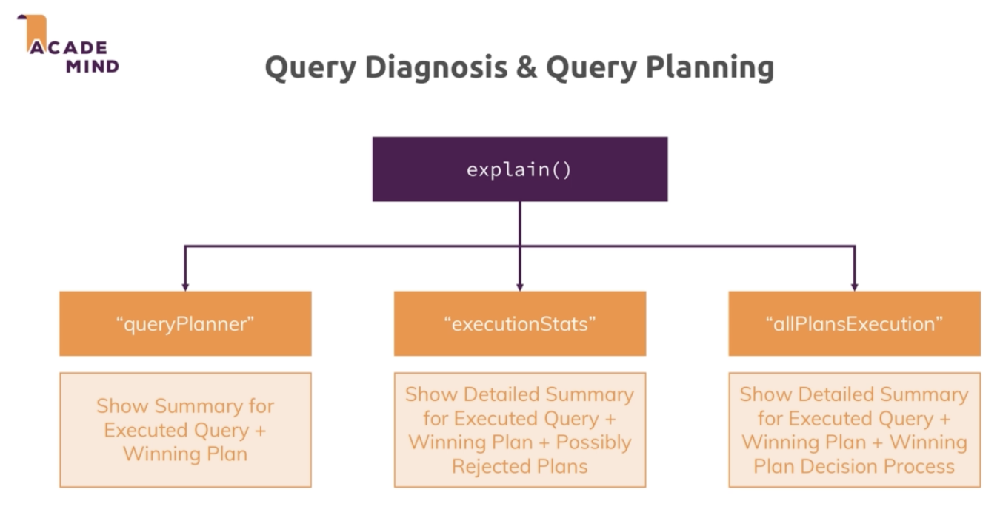
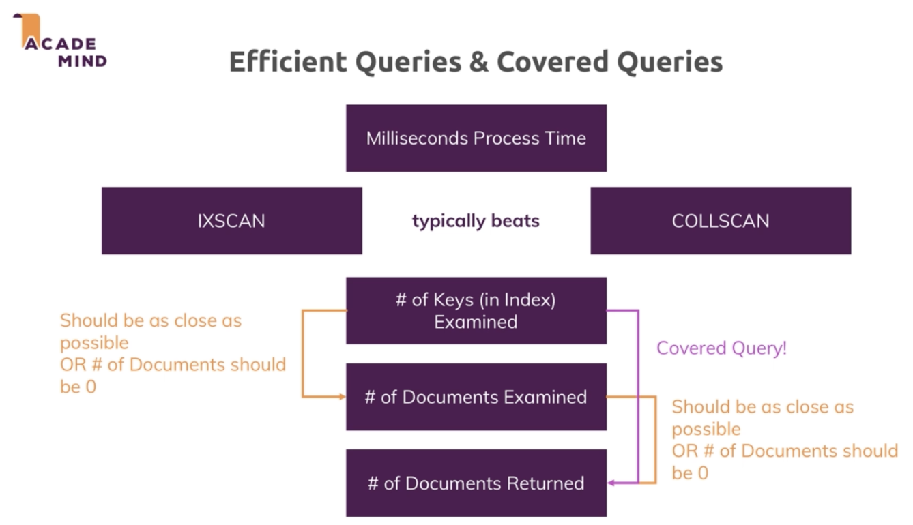
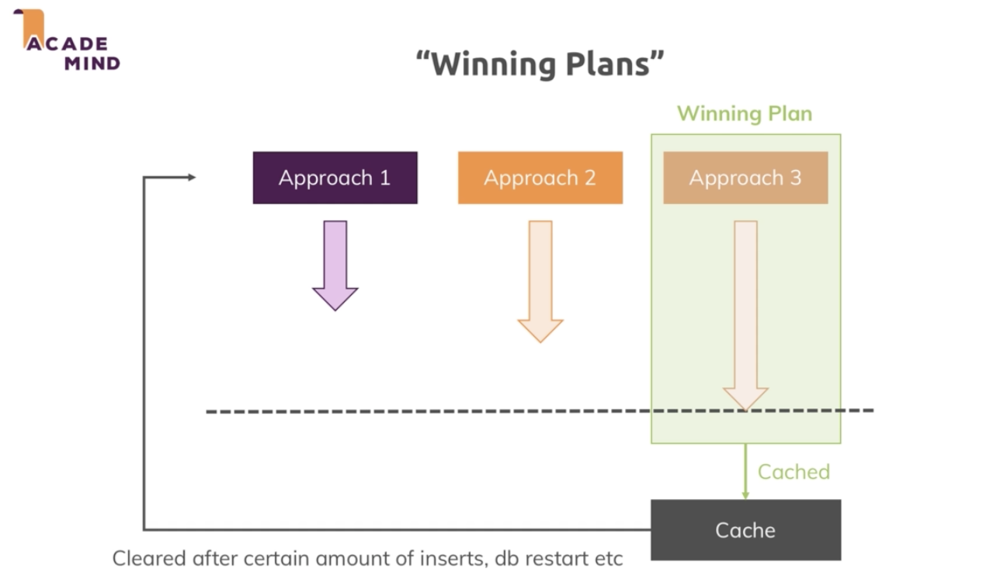
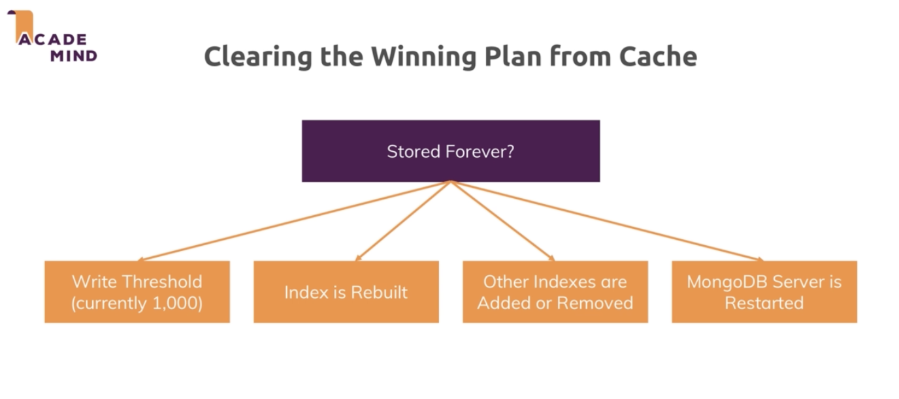
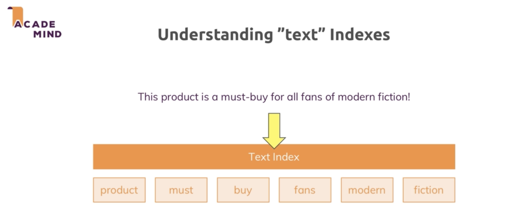

# 10 WORKING WITH INDEXES

- [x] [1. Why indexes](#1)
- [x] [2. Adding a Single Field Index](#2)
- [x] [3. Mongo command](#3)
- [x] [4. Tool to analyze](#4) 'COLLSCAN' collection scan vs 'IXSCAN' index scan
- [x] [5. Create Index](#5)
- [x] [6. Drop Index](#6)
- [x] [7. Creating Compound Index](#7)
- [x] [8. Using Indexes for sorting](#8)
- [x] [9. Configuring Indexes](#9)
- [x] [10. Partial Filters](#10)
- [x] [11. What difference between Partial index and Compound index](#11)
- [x] [12. Combination of unique and partial filter expression](#12)
- [x] [13. Time-To-Live (TTL) index](#13)
- [x] [14. Query diagnosis & query planning](#14)
- [x] [15. Using multi-key indexes](#15)
- [x] [16. Text indexes](#16)

---

## 1. Why indexes

> Why do we use Indexes


<br/>

> Don't Use Too Many Indexes

Because when we add a new document, we also have to add a new element to the index.


---

## <a name="2">2. Adding a Single Field Index</a>

1.connect mongo-local-db

Terminal-1

```
> mongod --dbpath /usr/local/var
```

2.Add data from file persons.json to mongo-local-db db name contactData document name contacts run command at the root project directory

Terminal-2

```
> mongoimport persons.json -d contactData -c contacts --jsonArray
```

---

## <a name="3">3. Mongo command</a>

> Mongo command (after 1,2) at Terminal-3 run command `mongo`

1. `show dbs`

Terminal-3

```
> mongo
> show dbs
admin        0.000GB
config       0.000GB
contactData  0.003GB
local        0.000GB
>
```

2. `use contactData`

```
> show dbs
admin        0.000GB
config       0.000GB
contactData  0.003GB
local        0.000GB
> use contactData
switched to db contactData
>
```

3. `show collections`

```
> show dbs
admin        0.000GB
config       0.000GB
contactData  0.003GB
local        0.000GB
> use contactData
switched to db contactData
> show collections
contacts
>
```

4. findOne `db.contacts.findOne()` return random data

```JSON
> db.contacts.findOne()
{
	"_id" : ObjectId("5e0c6b63b9525e53802ea74e"),
	"gender" : "male",
	"name" : {
		"title" : "mr",
		"first" : "victor",
		"last" : "pedersen"
	},
	"location" : {
		"street" : "2156 stenbjergvej",
		"city" : "billum",
		"state" : "nordjylland",
		"postcode" : 56649,
		"coordinates" : {
			"latitude" : "-29.8113",
			"longitude" : "-31.0208"
		},
		"timezone" : {
			"offset" : "+5:30",
			"description" : "Bombay, Calcutta, Madras, New Delhi"
		}
	},
	"email" : "victor.pedersen@example.com",
	"login" : {
		"uuid" : "fbb3c298-2cea-4415-84d1-74233525c325",
		"username" : "smallbutterfly536",
		"password" : "down",
		"salt" : "iW5QrgwW",
		"md5" : "3cc8b8a4d69321a408cd46174e163594",
		"sha1" : "681c0353b34fae08422686eea190e1c09472fc1f",
		"sha256" : "eb5251e929c56dfd19fc597123ed6ec2d0130a2c3c1bf8fc9c2ff8f29830a3b7"
	},
	"dob" : {
		"date" : "1959-02-19T23:56:23Z",
		"age" : 59
	},
	"registered" : {
		"date" : "2004-07-07T22:37:39Z",
		"age" : 14
	},
	"phone" : "23138213",
	"cell" : "30393606",
	"id" : {
		"name" : "CPR",
		"value" : "506102-2208"
	},
	"picture" : {
		"large" : "https://randomuser.me/api/portraits/men/23.jpg",
		"medium" : "https://randomuser.me/api/portraits/med/men/23.jpg",
		"thumbnail" : "https://randomuser.me/api/portraits/thumb/men/23.jpg"
	},
	"nat" : "DK"
}
>
```

5. run a query and let's find all people who are older than 60 `db.contacts.findOne({"dob.age": {$gt: 60}})`

```JSON
> db.contacts.findOne({"dob.age": {$gt: 60}})
{
	"_id" : ObjectId("5e0c6b63b9525e53802ea755"),
	"gender" : "female",
	"name" : {
		"title" : "mrs",
		"first" : "madeleine",
		"last" : "till"
	},
	"location" : {
		"street" : "im winkel 166",
		"city" : "villingen-schwenningen",
		"state" : "baden-württemberg",
		"postcode" : 32227,
		"coordinates" : {
			"latitude" : "83.3998",
			"longitude" : "-172.3753"
		},
		"timezone" : {
			"offset" : "+5:30",
			"description" : "Bombay, Calcutta, Madras, New Delhi"
		}
	},
	"email" : "madeleine.till@example.com",
	"login" : {
		"uuid" : "e70766b6-9d4f-419f-85c5-efc3c42db023",
		"username" : "goldencat450",
		"password" : "panthers",
		"salt" : "mHOsDM43",
		"md5" : "a97539f5d7b6c7302d3f3c1dd1d389b5",
		"sha1" : "a991dd190a83856b04d41a5e64bc41b5728b6903",
		"sha256" : "bd123b2b2aae61c6e8d3449bb14c6a032b4860275da781f8ffc73f5500e667bd"
	},
	"dob" : {
		"date" : "1954-05-01T02:34:40Z",
		"age" : 64
	},
	"registered" : {
		"date" : "2008-06-14T03:14:37Z",
		"age" : 10
	},
	"phone" : "0209-9573743",
	"cell" : "0173-1226290",
	"id" : {
		"name" : "",
		"value" : null
	},
	"picture" : {
		"large" : "https://randomuser.me/api/portraits/women/27.jpg",
		"medium" : "https://randomuser.me/api/portraits/med/women/27.jpg",
		"thumbnail" : "https://randomuser.me/api/portraits/thumb/women/27.jpg"
	},
	"nat" : "DE"
}
```

5. find count `db.contacts.find({"dob.age": {$gt: 60}}).count()`

```
> db.contacts.find({"dob.age": {$gt: 60}}).count()
1222
>
```

---

## <a name="4">4. Tool to analyze</a>

1. Mongodb gives use a Tool to analyze how it executed the quey just add `explain()` keyword after document and ex `db.contacts.explain().find({"dob.age": {$gt: 60}})`

```JSON
> db.contacts.explain().find({"dob.age": {$gt: 60}})
{
	"queryPlanner" : {
		"plannerVersion" : 1,
		"namespace" : "contactData.contacts",
		"indexFilterSet" : false,
		"parsedQuery" : {
			"dob.age" : {
				"$gt" : 60
			}
		},
		"winningPlan" : {
			"stage" : "COLLSCAN",
			"filter" : {
				"dob.age" : {
					"$gt" : 60
				}
			},
			"direction" : "forward"
		},
		"rejectedPlans" : [ ]
	},
	"serverInfo" : {
		"host" : "wudtichais-MBP",
		"port" : 27017,
		"version" : "4.0.3",
		"gitVersion" : "7ea530946fa7880364d88c8d8b6026bbc9ffa48c"
	},
	"ok" : 1
}
>
```

2. <a name="executionStates">Tool to analyze. arguments `.explain("executionStates").`</a>

> Note: Robo 3T use command link this `db.getCollection('contacts').find({"dob.age": {$gt: 60}}).explain("executionStats")`

```JSON
> db.contacts.explain("executionStats").find({"dob.age": {$gt: 60}})
{
	"queryPlanner" : {
		"plannerVersion" : 1,
		"namespace" : "contactData.contacts",
		"indexFilterSet" : false,
		"parsedQuery" : {
			"dob.age" : {
				"$gt" : 60
			}
		},
		"winningPlan" : {
			"stage" : "COLLSCAN",
			"filter" : {
				"dob.age" : {
					"$gt" : 60
				}
			},
			"direction" : "forward"
		},
		"rejectedPlans" : [ ]
	},
	"executionStats" : {
		"executionSuccess" : true,
		"nReturned" : 1222,
		"executionTimeMillis" : 4,
		"totalKeysExamined" : 0,
		"totalDocsExamined" : 5000,
		"executionStages" : {
			"stage" : "COLLSCAN",
			"filter" : {
				"dob.age" : {
					"$gt" : 60
				}
			},
			"nReturned" : 1222,
			"executionTimeMillisEstimate" : 0,
			"works" : 5002,
			"advanced" : 1222,
			"needTime" : 3779,
			"needYield" : 0,
			"saveState" : 39,
			"restoreState" : 39,
			"isEOF" : 1,
			"invalidates" : 0,
			"direction" : "forward",
			"docsExamined" : 5000
		}
	},
	"serverInfo" : {
		"host" : "wudtichais-MBP",
		"port" : 27017,
		"version" : "4.0.3",
		"gitVersion" : "7ea530946fa7880364d88c8d8b6026bbc9ffa48c"
	},
	"ok" : 1
}
>
```

---

## <a name="5">5. Create Index</a>

- assigning `db.contacts.createIndex({"dob.age": 1})` add 1 lower order come first higher values towards the end.
- descending `db.contacts.createIndex({"dob.age": - 1})` add -1

Assigning index

```
> db.contacts.createIndex({"dob.age": 1})
{
	"createdCollectionAutomatically" : false,
	"numIndexesBefore" : 1,
	"numIndexesAfter" : 2,
	"ok" : 1
}
>
```

<br/>

> Test query speed agin after created index for 'dob.age'

Before create Index

from [executionStates](#executionStates) query `db.contacts.explain("executionStats").find({"dob.age": {$gt: 60}})` return

- executionTimeMillis = 4,
- executionStages.works = 5000 all of the documents

After create Index

return

- executionTimeMillis = 4,
- executionStages.works = 1223 only index
- inputStage.stage = "IXSCAN",

```JSON
> db.contacts.explain("executionStats").find({"dob.age": {$gt: 60}})
{
	"queryPlanner" : {
		"plannerVersion" : 1,
		"namespace" : "contactData.contacts",
		"indexFilterSet" : false,
		"parsedQuery" : {
			"dob.age" : {
				"$gt" : 60
			}
		},
		"winningPlan" : {
			"stage" : "FETCH",
			"inputStage" : {
				"stage" : "IXSCAN",
				"keyPattern" : {
					"dob.age" : 1
				},
				"indexName" : "dob.age_1",
				"isMultiKey" : false,
				"multiKeyPaths" : {
					"dob.age" : [ ]
				},
				"isUnique" : false,
				"isSparse" : false,
				"isPartial" : false,
				"indexVersion" : 2,
				"direction" : "forward",
				"indexBounds" : {
					"dob.age" : [
						"(60.0, inf.0]"
					]
				}
			}
		},
		"rejectedPlans" : [ ]
	},
	"executionStats" : {
		"executionSuccess" : true,
		"nReturned" : 1222,
		"executionTimeMillis" : 3,
		"totalKeysExamined" : 1222,
		"totalDocsExamined" : 1222,
		"executionStages" : {
			"stage" : "FETCH",
			"nReturned" : 1222,
			"executionTimeMillisEstimate" : 0,
			"works" : 1223,
			"advanced" : 1222,
			"needTime" : 0,
			"needYield" : 0,
			"saveState" : 9,
			"restoreState" : 9,
			"isEOF" : 1,
			"invalidates" : 0,
			"docsExamined" : 1222,
			"alreadyHasObj" : 0,
			"inputStage" : {
				"stage" : "IXSCAN",
				"nReturned" : 1222,
				"executionTimeMillisEstimate" : 0,
				"works" : 1223,
				"advanced" : 1222,
				"needTime" : 0,
				"needYield" : 0,
				"saveState" : 9,
				"restoreState" : 9,
				"isEOF" : 1,
				"invalidates" : 0,
				"keyPattern" : {
					"dob.age" : 1
				},
				"indexName" : "dob.age_1",
				"isMultiKey" : false,
				"multiKeyPaths" : {
					"dob.age" : [ ]
				},
				"isUnique" : false,
				"isSparse" : false,
				"isPartial" : false,
				"indexVersion" : 2,
				"direction" : "forward",
				"indexBounds" : {
					"dob.age" : [
						"(60.0, inf.0]"
					]
				},
				"keysExamined" : 1222,
				"seeks" : 1,
				"dupsTested" : 0,
				"dupsDropped" : 0,
				"seenInvalidated" : 0
			}
		}
	},
	"serverInfo" : {
		"host" : "wudtichais-MBP",
		"port" : 27017,
		"version" : "4.0.3",
		"gitVersion" : "7ea530946fa7880364d88c8d8b6026bbc9ffa48c"
	},
	"ok" : 1
}
```

---

## <a name="6">6. Drop Index</a>

Note: If you have a dataset where your queries typically only return fractions, link 10% or 20% or lower of the documents, then indexes will almost certainly always speed it up.

```
> db.contacts.dropIndex({"dob.age": 1})
{ "nIndexesWas" : 2, "ok" : 1 }
>
```

> Full collection scan vs Indexes scan

If query return a lot of result (more than 20%) Index will return slower because it's have extra step to go through.

with Index (Indexes scan)

```JSON
> db.contacts.explain("executionStats").find({"dob.age": {$gt: 20}})
{
	"queryPlanner" : {
		"plannerVersion" : 1,
		"namespace" : "contactData.contacts",
		"indexFilterSet" : false,
		"parsedQuery" : {
			"dob.age" : {
				"$gt" : 20
			}
		},
		"winningPlan" : {
			"stage" : "FETCH",
			"inputStage" : {
				"stage" : "IXSCAN",
				"keyPattern" : {
					"dob.age" : 1
				},
				"indexName" : "dob.age_1",
				"isMultiKey" : false,
				"multiKeyPaths" : {
					"dob.age" : [ ]
				},
				"isUnique" : false,
				"isSparse" : false,
				"isPartial" : false,
				"indexVersion" : 2,
				"direction" : "forward",
				"indexBounds" : {
					"dob.age" : [
						"(20.0, inf.0]"
					]
				}
			}
		},
		"rejectedPlans" : [ ]
	},
	"executionStats" : {
		"executionSuccess" : true,
		"nReturned" : 5000,
		"executionTimeMillis" : 11,
		"totalKeysExamined" : 5000,
		"totalDocsExamined" : 5000,
		"executionStages" : {
			"stage" : "FETCH",
			"nReturned" : 5000,
			"executionTimeMillisEstimate" : 11,
			"works" : 5001,
			"advanced" : 5000,
			"needTime" : 0,
			"needYield" : 0,
			"saveState" : 39,
			"restoreState" : 39,
			"isEOF" : 1,
			"invalidates" : 0,
			"docsExamined" : 5000,
			"alreadyHasObj" : 0,
			"inputStage" : {
				"stage" : "IXSCAN",
				"nReturned" : 5000,
				"executionTimeMillisEstimate" : 11,
				"works" : 5001,
				"advanced" : 5000,
				"needTime" : 0,
				"needYield" : 0,
				"saveState" : 39,
				"restoreState" : 39,
				"isEOF" : 1,
				"invalidates" : 0,
				"keyPattern" : {
					"dob.age" : 1
				},
				"indexName" : "dob.age_1",
				"isMultiKey" : false,
				"multiKeyPaths" : {
					"dob.age" : [ ]
				},
				"isUnique" : false,
				"isSparse" : false,
				"isPartial" : false,
				"indexVersion" : 2,
				"direction" : "forward",
				"indexBounds" : {
					"dob.age" : [
						"(20.0, inf.0]"
					]
				},
				"keysExamined" : 5000,
				"seeks" : 1,
				"dupsTested" : 0,
				"dupsDropped" : 0,
				"seenInvalidated" : 0
			}
		}
	},
	"serverInfo" : {
		"host" : "wudtichais-MBP",
		"port" : 27017,
		"version" : "4.0.3",
		"gitVersion" : "7ea530946fa7880364d88c8d8b6026bbc9ffa48c"
	},
	"ok" : 1
}
>
```

with out Index (Full collection scan)

```JSON
> db.contacts.explain("executionStats").find({"dob.age": {$gt: 20}})
{
	"queryPlanner" : {
		"plannerVersion" : 1,
		"namespace" : "contactData.contacts",
		"indexFilterSet" : false,
		"parsedQuery" : {
			"dob.age" : {
				"$gt" : 20
			}
		},
		"winningPlan" : {
			"stage" : "COLLSCAN",
			"filter" : {
				"dob.age" : {
					"$gt" : 20
				}
			},
			"direction" : "forward"
		},
		"rejectedPlans" : [ ]
	},
	"executionStats" : {
		"executionSuccess" : true,
		"nReturned" : 5000,
		"executionTimeMillis" : 9,
		"totalKeysExamined" : 0,
		"totalDocsExamined" : 5000,
		"executionStages" : {
			"stage" : "COLLSCAN",
			"filter" : {
				"dob.age" : {
					"$gt" : 20
				}
			},
			"nReturned" : 5000,
			"executionTimeMillisEstimate" : 0,
			"works" : 5002,
			"advanced" : 5000,
			"needTime" : 1,
			"needYield" : 0,
			"saveState" : 39,
			"restoreState" : 39,
			"isEOF" : 1,
			"invalidates" : 0,
			"direction" : "forward",
			"docsExamined" : 5000
		}
	},
	"serverInfo" : {
		"host" : "wudtichais-MBP",
		"port" : 27017,
		"version" : "4.0.3",
		"gitVersion" : "7ea530946fa7880364d88c8d8b6026bbc9ffa48c"
	},
	"ok" : 1
}
```

---

## <a name="7">7. Creating Compound Index</a>


Note: IXSCAN = index scan, COLLSCAN = collection scan

before start clear old Index

clear "dob.age" Index

```
> db.contacts.dropIndex({"dob.age": 1})
{ "nIndexesWas" : 3, "ok" : 1 }
```

<br/>

clear gender Index

```
> db.contacts.dropIndex({gender: 1})
{ "nIndexesWas" : 2, "ok" : 1 }
```

<br/>

create compound Indexes 'dob.age' and 'gender', we got 2 fields and this will essentially store one Index where each entry in the index in is now not on a single value but two combined values. <b>`So it does not create 2 indexes`</b>

<br/>

create compound Indexes

```
> db.contacts.createIndex({"dob.age":1, gender:1})
{
	"createdCollectionAutomatically" : false,
	"numIndexesBefore" : 1,
	"numIndexesAfter" : 2,
	"ok" : 1
}
>
```

<br/>

compound query

use index `"indexName" : "dob.age_1_gender_1"`

```JSON
> db.contacts.explain().find({"dob.age": 35, gender: "male"})
{
	"queryPlanner" : {
		"plannerVersion" : 1,
		"namespace" : "contactData.contacts",
		"indexFilterSet" : false,
		"parsedQuery" : {
			"$and" : [
				{
					"dob.age" : {
						"$eq" : 35
					}
				},
				{
					"gender" : {
						"$eq" : "male"
					}
				}
			]
		},
		"winningPlan" : {
			"stage" : "FETCH",
			"inputStage" : {
				"stage" : "IXSCAN",
				"keyPattern" : {
					"dob.age" : 1,
					"gender" : 1
				},
				"indexName" : "dob.age_1_gender_1",
				"isMultiKey" : false,
				"multiKeyPaths" : {
					"dob.age" : [ ],
					"gender" : [ ]
				},
				"isUnique" : false,
				"isSparse" : false,
				"isPartial" : false,
				"indexVersion" : 2,
				"direction" : "forward",
				"indexBounds" : {
					"dob.age" : [
						"[35.0, 35.0]"
					],
					"gender" : [
						"[\"male\", \"male\"]"
					]
				}
			}
		},
		"rejectedPlans" : [ ]
	},
	"serverInfo" : {
		"host" : "wudtichais-MBP",
		"port" : 27017,
		"version" : "4.0.3",
		"gitVersion" : "7ea530946fa7880364d88c8d8b6026bbc9ffa48c"
	},
	"ok" : 1
}
>
```

<br/>

query just only left `"dob.age": 35` still use index scan `IXSCAN` `"indexName" : "dob.age_1_gender_1"`

Note: compound indexes can use from left to right

```JSON
> db.contacts.explain().find({"dob.age": 35})
{
	"queryPlanner" : {
		"plannerVersion" : 1,
		"namespace" : "contactData.contacts",
		"indexFilterSet" : false,
		"parsedQuery" : {
			"dob.age" : {
				"$eq" : 35
			}
		},
		"winningPlan" : {
			"stage" : "FETCH",
			"inputStage" : {
				"stage" : "IXSCAN",
				"keyPattern" : {
					"dob.age" : 1,
					"gender" : 1
				},
				"indexName" : "dob.age_1_gender_1",
				"isMultiKey" : false,
				"multiKeyPaths" : {
					"dob.age" : [ ],
					"gender" : [ ]
				},
				"isUnique" : false,
				"isSparse" : false,
				"isPartial" : false,
				"indexVersion" : 2,
				"direction" : "forward",
				"indexBounds" : {
					"dob.age" : [
						"[35.0, 35.0]"
					],
					"gender" : [
						"[MinKey, MaxKey]"
					]
				}
			}
		},
		"rejectedPlans" : [ ]
	},
	"serverInfo" : {
		"host" : "wudtichais-MBP",
		"port" : 27017,
		"version" : "4.0.3",
		"gitVersion" : "7ea530946fa7880364d88c8d8b6026bbc9ffa48c"
	},
	"ok" : 1
}
>
```

<br/>

query just only right `gender: "male"` it will use collection scan `COLLSCAN`

```JSON
> db.contacts.explain().find({gender: "male"})
{
	"queryPlanner" : {
		"plannerVersion" : 1,
		"namespace" : "contactData.contacts",
		"indexFilterSet" : false,
		"parsedQuery" : {
			"gender" : {
				"$eq" : "male"
			}
		},
		"winningPlan" : {
			"stage" : "COLLSCAN",
			"filter" : {
				"gender" : {
					"$eq" : "male"
				}
			},
			"direction" : "forward"
		},
		"rejectedPlans" : [ ]
	},
	"serverInfo" : {
		"host" : "wudtichais-MBP",
		"port" : 27017,
		"version" : "4.0.3",
		"gitVersion" : "7ea530946fa7880364d88c8d8b6026bbc9ffa48c"
	},
	"ok" : 1
}
>
```

---

## <a name="8">8. Using Indexes for sorting]</a>

Note: mongodb has a threshold of 32 megabytes in memory for sorting and if you have no index, mongodb will essentially fetch all your documents into memory and do the sort there.

```JSON
> db.contacts.explain().find({"dob.age": 35}).sort({gender: 1})
{
	"queryPlanner" : {
		"plannerVersion" : 1,
		"namespace" : "contactData.contacts",
		"indexFilterSet" : false,
		"parsedQuery" : {
			"dob.age" : {
				"$eq" : 35
			}
		},
		"winningPlan" : {
			"stage" : "FETCH",
			"inputStage" : {
				"stage" : "IXSCAN",
				"keyPattern" : {
					"dob.age" : 1,
					"gender" : 1
				},
				"indexName" : "dob.age_1_gender_1",
				"isMultiKey" : false,
				"multiKeyPaths" : {
					"dob.age" : [ ],
					"gender" : [ ]
				},
				"isUnique" : false,
				"isSparse" : false,
				"isPartial" : false,
				"indexVersion" : 2,
				"direction" : "forward",
				"indexBounds" : {
					"dob.age" : [
						"[35.0, 35.0]"
					],
					"gender" : [
						"[MinKey, MaxKey]"
					]
				}
			}
		},
		"rejectedPlans" : [ ]
	},
	"serverInfo" : {
		"host" : "wudtichais-MBP",
		"port" : 27017,
		"version" : "4.0.3",
		"gitVersion" : "7ea530946fa7880364d88c8d8b6026bbc9ffa48c"
	},
	"ok" : 1
}
```

---

## <a name="9">9. Configuring Indexes</a>

create `Index` and `unique` value

Error duplicate

```
> db.contacts.createIndex({email:1}, {unique: true})
{
	"ok" : 0,
	"errmsg" : "E11000 duplicate key error collection: contactData.contacts index: email_1 dup key: { : \"abigail.clark@example.com\" }",
	"code" : 11000,
	"codeName" : "DuplicateKey"
}
>
```

<br/>

Find duplicate value `email: "abigail.clark@example.com"`

```JSON
> db.contacts.find({email: 'abigail.clark@example.com'}).pretty()
{
	"_id" : ObjectId("5e0c6b63b9525e53802eaee6"),
	"gender" : "female",
	"name" : {
		"title" : "miss",
		"first" : "abigail",
		"last" : "clark"
	},
	"location" : {
		"street" : "9677 st. lawrence ave",
		"city" : "aylmer",
		"state" : "québec",
		"postcode" : "F6J 8U1",
		"coordinates" : {
			"latitude" : "-61.8849",
			"longitude" : "-84.5766"
		},
		"timezone" : {
			"offset" : "+9:30",
			"description" : "Adelaide, Darwin"
		}
	},
	"email" : "abigail.clark@example.com",
	"login" : {
		"uuid" : "a716f860-ba7b-4cb4-890d-2f05ba8f1130",
		"username" : "whitefish879",
		"password" : "1955",
		"salt" : "LnZqDwt4",
		"md5" : "2bfe0c8e7a9ba85f6621a4964fc7776c",
		"sha1" : "fec92eeaaab5913f075d839db986cfa8f095ca82",
		"sha256" : "099e44d8b9f7902df90f22f3914d5d4641296ff7ab364bcf1d64e346cfd9cd23"
	},
	"dob" : {
		"date" : "1968-01-18T05:26:30Z",
		"age" : 50
	},
	"registered" : {
		"date" : "2014-09-22T01:38:30Z",
		"age" : 3
	},
	"phone" : "438-193-7599",
	"cell" : "184-658-2267",
	"id" : {
		"name" : "",
		"value" : null
	},
	"picture" : {
		"large" : "https://randomuser.me/api/portraits/women/93.jpg",
		"medium" : "https://randomuser.me/api/portraits/med/women/93.jpg",
		"thumbnail" : "https://randomuser.me/api/portraits/thumb/women/93.jpg"
	},
	"nat" : "CA"
}
{
	"_id" : ObjectId("5e0c6b63b9525e53802eb531"),
	"gender" : "female",
	"name" : {
		"title" : "mrs",
		"first" : "abigail",
		"last" : "clark"
	},
	"location" : {
		"street" : "8067 argyle st",
		"city" : "grand falls",
		"state" : "prince edward island",
		"postcode" : "K0M 1H7",
		"coordinates" : {
			"latitude" : "42.2225",
			"longitude" : "45.5194"
		},
		"timezone" : {
			"offset" : "-5:00",
			"description" : "Eastern Time (US & Canada), Bogota, Lima"
		}
	},
	"email" : "abigail.clark@example.com",
	"login" : {
		"uuid" : "08ee8142-1126-4e94-9587-13ea17d8e8da",
		"username" : "greenzebra872",
		"password" : "doudou",
		"salt" : "eHejWeiE",
		"md5" : "fd466a6c5417bce67d14966c4a5b87d8",
		"sha1" : "22e48f2072a8365eea0a15331430f0522bfd6cb7",
		"sha256" : "fb1bad920e555342d414c3ef3ce15dac487d174ec8983781667070065a10f1ef"
	},
	"dob" : {
		"date" : "1948-12-08T01:09:03Z",
		"age" : 69
	},
	"registered" : {
		"date" : "2014-05-22T14:42:50Z",
		"age" : 4
	},
	"phone" : "522-306-4813",
	"cell" : "910-566-1400",
	"id" : {
		"name" : "",
		"value" : null
	},
	"picture" : {
		"large" : "https://randomuser.me/api/portraits/women/21.jpg",
		"medium" : "https://randomuser.me/api/portraits/med/women/21.jpg",
		"thumbnail" : "https://randomuser.me/api/portraits/thumb/women/21.jpg"
	},
	"nat" : "CA"
}
>
```

---

## <a name="10">10. Partial Filters</a>

1. get Indexes

```
> db.contacts.getIndexes()
[
	{
		"v" : 2,
		"key" : {
			"_id" : 1
		},
		"name" : "_id_",
		"ns" : "contactData.contacts"
	},
	{
		"v" : 2,
		"key" : {
			"dob.age" : 1,
			"gender" : 1
		},
		"name" : "dob.age_1_gender_1",
		"ns" : "contactData.contacts"
	}
]
```

<br/>
2. drop index "name" : "dob.age_1_gender_1",

```
> db.contacts.dropIndex({"dob.age": 1, gender: 1})
{ "nIndexesWas" : 3, "ok" : 1 }
```

3. get Indexes

```
> db.contacts.getIndexes()
[
	{
		"v" : 2,
		"key" : {
			"_id" : 1
		},
		"name" : "_id_",
		"ns" : "contactData.contacts"
	}
]
```

<br/>
4.create partial Index different field

```
> db.contacts.createIndex({"dob.age": 1}, {partialFilterExpression: {gender: "male"}})
{
	"createdCollectionAutomatically" : false,
	"numIndexesBefore" : 2,
	"numIndexesAfter" : 3,
	"ok" : 1
}
```

<br/>
5. get Index

```
> db.contacts.getIndexes()
[
	{
		"v" : 2,
		"key" : {
			"_id" : 1
		},
		"name" : "_id_",
		"ns" : "contactData.contacts"
	},
	{
		"v" : 2,
		"key" : {
			"dob.age" : 1
		},
		"name" : "dob.age_1",
		"ns" : "contactData.contacts",
		"partialFilterExpression" : {
			"gender" : "male"
		}
	}
]
```

<br/>

5. test explain find only 'dob.age' result will use <b>`collection scan COLLSCAN`</b>

```JSON
> db.contacts.explain().find({"dob.age": {$gt: 60}})
{
	"queryPlanner" : {
		"plannerVersion" : 1,
		"namespace" : "contactData.contacts",
		"indexFilterSet" : false,
		"parsedQuery" : {
			"dob.age" : {
				"$gt" : 60
			}
		},
		"winningPlan" : {
			"stage" : "COLLSCAN",
			"filter" : {
				"dob.age" : {
					"$gt" : 60
				}
			},
			"direction" : "forward"
		},
		"rejectedPlans" : [ ]
	},
	"serverInfo" : {
		"host" : "wudtichais-MBP",
		"port" : 27017,
		"version" : "4.0.3",
		"gitVersion" : "7ea530946fa7880364d88c8d8b6026bbc9ffa48c"
	},
	"ok" : 1
}
```

<br/>

6. partial search meaning. test find with `dob.age` and `gender: "male"` result will use <b>`index search IXSCAN`</b>

```JSON
> db.contacts.explain().find({"dob.age": {$gt: 60}, gender: "male"})
{
	"queryPlanner" : {
		"plannerVersion" : 1,
		"namespace" : "contactData.contacts",
		"indexFilterSet" : false,
		"parsedQuery" : {
			"$and" : [
				{
					"gender" : {
						"$eq" : "male"
					}
				},
				{
					"dob.age" : {
						"$gt" : 60
					}
				}
			]
		},
		"winningPlan" : {
			"stage" : "FETCH",
			"filter" : {
				"gender" : {
					"$eq" : "male"
				}
			},
			"inputStage" : {
				"stage" : "IXSCAN",
				"keyPattern" : {
					"dob.age" : 1
				},
				"indexName" : "dob.age_1",
				"isMultiKey" : false,
				"multiKeyPaths" : {
					"dob.age" : [ ]
				},
				"isUnique" : false,
				"isSparse" : false,
				"isPartial" : true,
				"indexVersion" : 2,
				"direction" : "forward",
				"indexBounds" : {
					"dob.age" : [
						"(60.0, inf.0]"
					]
				}
			}
		},
		"rejectedPlans" : [ ]
	},
	"serverInfo" : {
		"host" : "wudtichais-MBP",
		"port" : 27017,
		"version" : "4.0.3",
		"gitVersion" : "7ea530946fa7880364d88c8d8b6026bbc9ffa48c"
	},
	"ok" : 1
}
```

---

## <a name="11">11. What difference between Partial index and Compound index</a>

The difference is that for the partial index, the overall index simply is smaller, from example above there really are only the ages of males stored in there, the female keys are not stored in the index and therefore, the index size is smaller leading to a lower impact on your hard drive and also your right queries are of course also sped up because if your insert a new female, that will never have to be added to your index.

---

## <a name="12">12. Combination of unique and partial filter expression </a>

1. insert many data to document name `users`

```
> db.users.insertMany([{name: 'Max', email: 'max@test.com'}, {name: 'Menu'}])
{
	"acknowledged" : true,
	"insertedIds" : [
		ObjectId("5e0cbb2c8a8b15d665e315f5"),
		ObjectId("5e0cbb2c8a8b15d665e315f6")
	]
}
>
```

2. create Index with and unique value

```
> db.users.createIndex({email: 1}, {unique: true})
{
	"createdCollectionAutomatically" : false,
	"numIndexesBefore" : 1,
	"numIndexesAfter" : 2,
	"ok" : 1
}
>
```

3. try to insert duplicate email value

```
> db.users.insertOne({email: 'max@test.com'})
2020-01-01T22:35:32.415+0700 E QUERY    [js] WriteError: E11000 duplicate key error collection: contactData.users index: email_1 dup key: { : "max@test.com" } :
WriteError({
	"index" : 0,
	"code" : 11000,
	"errmsg" : "E11000 duplicate key error collection: contactData.users index: email_1 dup key: { : \"max@test.com\" }",
	"op" : {
		"_id" : ObjectId("5e0cbc448a8b15d665e315f7"),
		"email" : "max@test.com"
	}
})
WriteError@src/mongo/shell/bulk_api.js:461:48
Bulk/mergeBatchResults@src/mongo/shell/bulk_api.js:841:49
Bulk/executeBatch@src/mongo/shell/bulk_api.js:906:13
Bulk/this.execute@src/mongo/shell/bulk_api.js:1150:21
DBCollection.prototype.insertOne@src/mongo/shell/crud_api.js:252:9
@(shell):1:1
>
```

4. dropIndex email

```
> db.users.dropIndex({email: 1})
{ "nIndexesWas" : 2, "ok" : 1 }
```

5. create (`Combination of unique and partial filter expression`)
   - index email
   - unique value
   - partialFilterExpression

> Meaning: Add elements email into index where the email filed exists

```
> db.users.createIndex({email: 1}, {unique: true, partialFilterExpression: {email: {$exists: true}}})
{
	"createdCollectionAutomatically" : false,
	"numIndexesBefore" : 1,
	"numIndexesAfter" : 2,
	"ok" : 1
}
>
```

## <a name="13">13. Time To Live (TTL) Index</a>

create test-01 data

```
> db.sessions.insertOne({data: 'romantic', createdAt: new Date()})
{
	"acknowledged" : true,
	"insertedId" : ObjectId("5e1bd55e0265664cfe303584")
}
```

get test data

```
> db.sessions.find().pretty()
{
	"_id" : ObjectId("5e1bd55e0265664cfe303584"),
	"data" : "romantic",
	"createdAt" : ISODate("2020-01-13T02:26:38.834Z")
}
```

create Index and use Time to live

```
// delete data after 10 seconds
> db.sessions.createIndex({createdAt: 1}, {expireAfterSeconds: 10})
{
	"createdCollectionAutomatically" : false,
	"numIndexesBefore" : 1,
	"numIndexesAfter" : 2,
	"ok" : 1
}
```

> Note: data test-01 after 10 seconds will note delete, because there was there before the index was added and the index does not delete elements in hindsight

> In this case I'm test test-01 does deleted too. because adding a new element basically triggered mongodb to now reevaluate the entire collection,

insert new test-02 element and then wait 10 seconds data will be delete.

```
> db.sessions.insertOne({data: 'romantic-02', createdAt: new Date()})
{
	"acknowledged" : true,
	"insertedId" : ObjectId("5e1bd75c0265664cfe303585")
}
>
```

## <a name="14">14. Query Diagnosis & Query Planing</a>

Query diagnosis & Query Planing


Efficient Queries & Covered Queries


---

Understanding Covered Queries

create data test-01

```Javascript
> db.customers.insertMany([{name: 'Max', age: 29, salary: 3000}, {name: 'Menu', age: 30, salary: 4000}])
{
	"acknowledged" : true,
	"insertedIds" : [
		ObjectId("5e1bdf560265664cfe303587"),
		ObjectId("5e1bdf560265664cfe303588")
	]
}
>
```

add index to data test-01

```Javascript
> db.customers.createIndex({name: 1})
{
	"createdCollectionAutomatically" : false,
	"numIndexesBefore" : 1,
	"numIndexesAfter" : 2,
	"ok" : 1
}
>
```

find and explain

>     "totalDocsExamined" : 1,

```Javascript
> db.customers.explain("executionStats").find({name: "Max"})
{
	"queryPlanner" : {
		"plannerVersion" : 1,
		"namespace" : "test.customers",
		"indexFilterSet" : false,
		"parsedQuery" : {
			"name" : {
				"$eq" : "Max"
			}
		},
		"winningPlan" : {
			"stage" : "FETCH",
			"inputStage" : {
				"stage" : "IXSCAN",
				"keyPattern" : {
					"name" : 1
				},
				"indexName" : "name_1",
				"isMultiKey" : false,
				"multiKeyPaths" : {
					"name" : [ ]
				},
				"isUnique" : false,
				"isSparse" : false,
				"isPartial" : false,
				"indexVersion" : 2,
				"direction" : "forward",
				"indexBounds" : {
					"name" : [
						"[\"Max\", \"Max\"]"
					]
				}
			}
		},
		"rejectedPlans" : [ ]
	},
	"executionStats" : {
		"executionSuccess" : true,
		"nReturned" : 1,
		"executionTimeMillis" : 5,
		"totalKeysExamined" : 1,
		"totalDocsExamined" : 1,
		"executionStages" : {
			"stage" : "FETCH",
			"nReturned" : 1,
			"executionTimeMillisEstimate" : 0,
			"works" : 2,
			"advanced" : 1,
			"needTime" : 0,
			"needYield" : 0,
			"saveState" : 0,
			"restoreState" : 0,
			"isEOF" : 1,
			"invalidates" : 0,
			"docsExamined" : 1,
			"alreadyHasObj" : 0,
			"inputStage" : {
				"stage" : "IXSCAN",
				"nReturned" : 1,
				"executionTimeMillisEstimate" : 0,
				"works" : 2,
				"advanced" : 1,
				"needTime" : 0,
				"needYield" : 0,
				"saveState" : 0,
				"restoreState" : 0,
				"isEOF" : 1,
				"invalidates" : 0,
				"keyPattern" : {
					"name" : 1
				},
				"indexName" : "name_1",
				"isMultiKey" : false,
				"multiKeyPaths" : {
					"name" : [ ]
				},
				"isUnique" : false,
				"isSparse" : false,
				"isPartial" : false,
				"indexVersion" : 2,
				"direction" : "forward",
				"indexBounds" : {
					"name" : [
						"[\"Max\", \"Max\"]"
					]
				},
				"keysExamined" : 1,
				"seeks" : 1,
				"dupsTested" : 0,
				"dupsDropped" : 0,
				"seenInvalidated" : 0
			}
		}
	},
	"serverInfo" : {
		"host" : "wudtichais-MacBook-Pro.local",
		"port" : 27017,
		"version" : "4.0.3",
		"gitVersion" : "7ea530946fa7880364d88c8d8b6026bbc9ffa48c"
	},
	"ok" : 1
}
>
```

find don't return \_id return just name

>     "totalDocsExamined" : 0,

```Javascript
> db.customers.explain("executionStats").find({name: "Max"}, {_id: 0, name: 1})
{
	"queryPlanner" : {
		"plannerVersion" : 1,
		"namespace" : "test.customers",
		"indexFilterSet" : false,
		"parsedQuery" : {
			"name" : {
				"$eq" : "Max"
			}
		},
		"winningPlan" : {
			"stage" : "PROJECTION",
			"transformBy" : {
				"_id" : 0,
				"name" : 1
			},
			"inputStage" : {
				"stage" : "IXSCAN",
				"keyPattern" : {
					"name" : 1
				},
				"indexName" : "name_1",
				"isMultiKey" : false,
				"multiKeyPaths" : {
					"name" : [ ]
				},
				"isUnique" : false,
				"isSparse" : false,
				"isPartial" : false,
				"indexVersion" : 2,
				"direction" : "forward",
				"indexBounds" : {
					"name" : [
						"[\"Max\", \"Max\"]"
					]
				}
			}
		},
		"rejectedPlans" : [ ]
	},
	"executionStats" : {
		"executionSuccess" : true,
		"nReturned" : 1,
		"executionTimeMillis" : 2,
		"totalKeysExamined" : 1,
		"totalDocsExamined" : 0,
		"executionStages" : {
			"stage" : "PROJECTION",
			"nReturned" : 1,
			"executionTimeMillisEstimate" : 0,
			"works" : 2,
			"advanced" : 1,
			"needTime" : 0,
			"needYield" : 0,
			"saveState" : 0,
			"restoreState" : 0,
			"isEOF" : 1,
			"invalidates" : 0,
			"transformBy" : {
				"_id" : 0,
				"name" : 1
			},
			"inputStage" : {
				"stage" : "IXSCAN",
				"nReturned" : 1,
				"executionTimeMillisEstimate" : 0,
				"works" : 2,
				"advanced" : 1,
				"needTime" : 0,
				"needYield" : 0,
				"saveState" : 0,
				"restoreState" : 0,
				"isEOF" : 1,
				"invalidates" : 0,
				"keyPattern" : {
					"name" : 1
				},
				"indexName" : "name_1",
				"isMultiKey" : false,
				"multiKeyPaths" : {
					"name" : [ ]
				},
				"isUnique" : false,
				"isSparse" : false,
				"isPartial" : false,
				"indexVersion" : 2,
				"direction" : "forward",
				"indexBounds" : {
					"name" : [
						"[\"Max\", \"Max\"]"
					]
				},
				"keysExamined" : 1,
				"seeks" : 1,
				"dupsTested" : 0,
				"dupsDropped" : 0,
				"seenInvalidated" : 0
			}
		}
	},
	"serverInfo" : {
		"host" : "wudtichais-MacBook-Pro.local",
		"port" : 27017,
		"version" : "4.0.3",
		"gitVersion" : "7ea530946fa7880364d88c8d8b6026bbc9ffa48c"
	},
	"ok" : 1
}
>
```

How mongodb reject a plan

```
> db.customers.getIndexes()
[
	{
		"v" : 2,
		"key" : {
			"_id" : 1
		},
		"name" : "_id_",
		"ns" : "test.customers"
	},
	{
		"v" : 2,
		"key" : {
			"name" : 1
		},
		"name" : "name_1",
		"ns" : "test.customers"
	}
]
>
```

create compound indexes

> Note: That the order here is important for compound indexes and if I would have put name first, this index here wouldn't make much sense because then I would have a single field index or name even though the name is the first field in a compound index and you learned from left to right, a compound index can be used well standalone, so each field can be used standalone from left to right.

> So in this case, if age comes first, we can also filter just for age and take advantage of this index, for name we can take advantage of this index because name is only the second value is mapped to the respective ages and only sorted within the age category, so if you filter for jus name and you didn't have that index, name could not be supported by index.

```
> db.customers.createIndex({age: 1, name: 1})
{
	"createdCollectionAutomatically" : false,
	"numIndexesBefore" : 2,
	"numIndexesAfter" : 3,
	"ok" : 1
}
>
```

get indexes to see compound index

```
> db.customers.getIndexes()
[
	{
		"v" : 2,
		"key" : {
			"_id" : 1
		},
		"name" : "_id_",
		"ns" : "test.customers"
	},
	{
		"v" : 2,
		"key" : {
			"name" : 1
		},
		"name" : "name_1",
		"ns" : "test.customers"
	},
	{
		"v" : 2,
		"key" : {
			"age" : 1,
			"name" : 1
		},
		"name" : "age_1_name_1",
		"ns" : "test.customers"
	}
]
>
```

### winningPlan vs rejectedPlans

search test compound index

> winningPlan vs rejectedPlans, how does mongodb figure out which plan is better?

mongodb uses an approach where it simply

first of all looks for indexes that could help you with the query at hand, so in our last lecture and example, we had the name single field index and age and name as a compound index. Since our query, our find method included a look for name, mongodb automatically derived that both the name single field index and the age name compound index could be helpful. So it came up with tow approaches, for other scenarios you might of course have more approaches,

Winning plans


```Javascript
// the order in which you specify you arguments when writing the query does not matter, our compound index was created with age as the first value and name as a second. mongodb does reverse it for us.
> db.customers.explain().find({name: "Max", age: 30})
{
	"queryPlanner" : {
		"plannerVersion" : 1,
		"namespace" : "test.customers",
		"indexFilterSet" : false,
		"parsedQuery" : {
			"$and" : [
				{
					"age" : {
						"$eq" : 30
					}
				},
				{
					"name" : {
						"$eq" : "Max"
					}
				}
			]
		},
		"winningPlan" : {
			"stage" : "FETCH",
			"inputStage" : {
				"stage" : "IXSCAN",
				"keyPattern" : {
					"age" : 1,
					"name" : 1
				},
				"indexName" : "age_1_name_1",
				"isMultiKey" : false,
				"multiKeyPaths" : {
					"age" : [ ],
					"name" : [ ]
				},
				"isUnique" : false,
				"isSparse" : false,
				"isPartial" : false,
				"indexVersion" : 2,
				"direction" : "forward",
				"indexBounds" : {
					"age" : [
						"[30.0, 30.0]"
					],
					"name" : [
						"[\"Max\", \"Max\"]"
					]
				}
			}
		},
		"rejectedPlans" : [
			{
				"stage" : "FETCH",
				"filter" : {
					"age" : {
						"$eq" : 30
					}
				},
				"inputStage" : {
					"stage" : "IXSCAN",
					"keyPattern" : {
						"name" : 1
					},
					"indexName" : "name_1",
					"isMultiKey" : false,
					"multiKeyPaths" : {
						"name" : [ ]
					},
					"isUnique" : false,
					"isSparse" : false,
					"isPartial" : false,
					"indexVersion" : 2,
					"direction" : "forward",
					"indexBounds" : {
						"name" : [
							"[\"Max\", \"Max\"]"
						]
					}
				}
			}
		]
	},
	"serverInfo" : {
		"host" : "wudtichais-MacBook-Pro.local",
		"port" : 27017,
		"version" : "4.0.3",
		"gitVersion" : "7ea530946fa7880364d88c8d8b6026bbc9ffa48c"
	},
	"ok" : 1
}
>
```

### Clearing the winning plan for cache

Winning plans


### allPlansExecution

```Javascript
> db.customers.explain("allPlansExecution").find({name: "Max", age: 30})
{
	"queryPlanner" : {
		"plannerVersion" : 1,
		"namespace" : "test.customers",
		"indexFilterSet" : false,
		"parsedQuery" : {
			"$and" : [
				{
					"age" : {
						"$eq" : 30
					}
				},
				{
					"name" : {
						"$eq" : "Max"
					}
				}
			]
		},
		"winningPlan" : {
			"stage" : "FETCH",
			"inputStage" : {
				"stage" : "IXSCAN",
				"keyPattern" : {
					"age" : 1,
					"name" : 1
				},
				"indexName" : "age_1_name_1",
				"isMultiKey" : false,
				"multiKeyPaths" : {
					"age" : [ ],
					"name" : [ ]
				},
				"isUnique" : false,
				"isSparse" : false,
				"isPartial" : false,
				"indexVersion" : 2,
				"direction" : "forward",
				"indexBounds" : {
					"age" : [
						"[30.0, 30.0]"
					],
					"name" : [
						"[\"Max\", \"Max\"]"
					]
				}
			}
		},
		"rejectedPlans" : [
			{
				"stage" : "FETCH",
				"filter" : {
					"age" : {
						"$eq" : 30
					}
				},
				"inputStage" : {
					"stage" : "IXSCAN",
					"keyPattern" : {
						"name" : 1
					},
					"indexName" : "name_1",
					"isMultiKey" : false,
					"multiKeyPaths" : {
						"name" : [ ]
					},
					"isUnique" : false,
					"isSparse" : false,
					"isPartial" : false,
					"indexVersion" : 2,
					"direction" : "forward",
					"indexBounds" : {
						"name" : [
							"[\"Max\", \"Max\"]"
						]
					}
				}
			}
		]
	},
	"executionStats" : {
		"executionSuccess" : true,
		"nReturned" : 0,
		"executionTimeMillis" : 0,
		"totalKeysExamined" : 0,
		"totalDocsExamined" : 0,
		"executionStages" : {
			"stage" : "FETCH",
			"nReturned" : 0,
			"executionTimeMillisEstimate" : 0,
			"works" : 2,
			"advanced" : 0,
			"needTime" : 0,
			"needYield" : 0,
			"saveState" : 0,
			"restoreState" : 0,
			"isEOF" : 1,
			"invalidates" : 0,
			"docsExamined" : 0,
			"alreadyHasObj" : 0,
			"inputStage" : {
				"stage" : "IXSCAN",
				"nReturned" : 0,
				"executionTimeMillisEstimate" : 0,
				"works" : 1,
				"advanced" : 0,
				"needTime" : 0,
				"needYield" : 0,
				"saveState" : 0,
				"restoreState" : 0,
				"isEOF" : 1,
				"invalidates" : 0,
				"keyPattern" : {
					"age" : 1,
					"name" : 1
				},
				"indexName" : "age_1_name_1",
				"isMultiKey" : false,
				"multiKeyPaths" : {
					"age" : [ ],
					"name" : [ ]
				},
				"isUnique" : false,
				"isSparse" : false,
				"isPartial" : false,
				"indexVersion" : 2,
				"direction" : "forward",
				"indexBounds" : {
					"age" : [
						"[30.0, 30.0]"
					],
					"name" : [
						"[\"Max\", \"Max\"]"
					]
				},
				"keysExamined" : 0,
				"seeks" : 1,
				"dupsTested" : 0,
				"dupsDropped" : 0,
				"seenInvalidated" : 0
			}
		},
		"allPlansExecution" : [
			{
				"nReturned" : 0,
				"executionTimeMillisEstimate" : 0,
				"totalKeysExamined" : 0,
				"totalDocsExamined" : 0,
				"executionStages" : {
					"stage" : "FETCH",
					"nReturned" : 0,
					"executionTimeMillisEstimate" : 0,
					"works" : 1,
					"advanced" : 0,
					"needTime" : 0,
					"needYield" : 0,
					"saveState" : 0,
					"restoreState" : 0,
					"isEOF" : 1,
					"invalidates" : 0,
					"docsExamined" : 0,
					"alreadyHasObj" : 0,
					"inputStage" : {
						"stage" : "IXSCAN",
						"nReturned" : 0,
						"executionTimeMillisEstimate" : 0,
						"works" : 1,
						"advanced" : 0,
						"needTime" : 0,
						"needYield" : 0,
						"saveState" : 0,
						"restoreState" : 0,
						"isEOF" : 1,
						"invalidates" : 0,
						"keyPattern" : {
							"age" : 1,
							"name" : 1
						},
						"indexName" : "age_1_name_1",
						"isMultiKey" : false,
						"multiKeyPaths" : {
							"age" : [ ],
							"name" : [ ]
						},
						"isUnique" : false,
						"isSparse" : false,
						"isPartial" : false,
						"indexVersion" : 2,
						"direction" : "forward",
						"indexBounds" : {
							"age" : [
								"[30.0, 30.0]"
							],
							"name" : [
								"[\"Max\", \"Max\"]"
							]
						},
						"keysExamined" : 0,
						"seeks" : 1,
						"dupsTested" : 0,
						"dupsDropped" : 0,
						"seenInvalidated" : 0
					}
				}
			},
			{
				"nReturned" : 0,
				"executionTimeMillisEstimate" : 0,
				"totalKeysExamined" : 1,
				"totalDocsExamined" : 1,
				"executionStages" : {
					"stage" : "FETCH",
					"filter" : {
						"age" : {
							"$eq" : 30
						}
					},
					"nReturned" : 0,
					"executionTimeMillisEstimate" : 0,
					"works" : 1,
					"advanced" : 0,
					"needTime" : 1,
					"needYield" : 0,
					"saveState" : 0,
					"restoreState" : 0,
					"isEOF" : 0,
					"invalidates" : 0,
					"docsExamined" : 1,
					"alreadyHasObj" : 0,
					"inputStage" : {
						"stage" : "IXSCAN",
						"nReturned" : 1,
						"executionTimeMillisEstimate" : 0,
						"works" : 1,
						"advanced" : 1,
						"needTime" : 0,
						"needYield" : 0,
						"saveState" : 0,
						"restoreState" : 0,
						"isEOF" : 0,
						"invalidates" : 0,
						"keyPattern" : {
							"name" : 1
						},
						"indexName" : "name_1",
						"isMultiKey" : false,
						"multiKeyPaths" : {
							"name" : [ ]
						},
						"isUnique" : false,
						"isSparse" : false,
						"isPartial" : false,
						"indexVersion" : 2,
						"direction" : "forward",
						"indexBounds" : {
							"name" : [
								"[\"Max\", \"Max\"]"
							]
						},
						"keysExamined" : 1,
						"seeks" : 1,
						"dupsTested" : 0,
						"dupsDropped" : 0,
						"seenInvalidated" : 0
					}
				}
			}
		]
	},
	"serverInfo" : {
		"host" : "wudtichais-MacBook-Pro.local",
		"port" : 27017,
		"version" : "4.0.3",
		"gitVersion" : "7ea530946fa7880364d88c8d8b6026bbc9ffa48c"
	},
	"ok" : 1
}
>
```

## <a name="15">15. Using multi key indexes</a>

drop clear old collection

```
> db.contacts.drop()
false
>
```

```
> db.contacts.insertOne({name: "Max", hobbies: ["Cooking", "Sports"], addresses: [{street: "Main Street"}, {street: "Secound Street"}]})
{
	"acknowledged" : true,
	"insertedId" : ObjectId("5e1c0fe20265664cfe30358b")
}
>
```

### test create Index a field that sore `Array`

```
> db.contacts.createIndex({hobbies: 1})
{
	"createdCollectionAutomatically" : false,
	"numIndexesBefore" : 1,
	"numIndexesAfter" : 2,
	"ok" : 1
}
>
```

> Note: what mongodb does is it pulls out all the values in your index key, so in hobbies in case here, so it pulls out all the values in the array that stored in there. This of course means that multikey indexes for a lot of documents are bigger than single field indexes because if every document has an array with let's say four values on average and you have a thousand documents and that array field is what you index, you would store four thousand elements because 4 \* 1000 = 4000

> Multikey indexes are possible but typically are also bigger, doesn't mean you shouldn't use them. If you typically query for an array and the value in an array well then it makes sense to turn this array into a multikey index, that is perfectly fine.

```Javascript
> db.contacts.explain("executionStats").find({hobbies: "Sports"})
{
	"queryPlanner" : {
		"plannerVersion" : 1,
		"namespace" : "test.contacts",
		"indexFilterSet" : false,
		"parsedQuery" : {
			"hobbies" : {
				"$eq" : "Sports"
			}
		},
		"winningPlan" : {
			"stage" : "FETCH",
			"inputStage" : {
				"stage" : "IXSCAN",
				"keyPattern" : {
					"hobbies" : 1
				},
				"indexName" : "hobbies_1",
				"isMultiKey" : true,
				"multiKeyPaths" : {
					"hobbies" : [
						"hobbies"
					]
				},
				"isUnique" : false,
				"isSparse" : false,
				"isPartial" : false,
				"indexVersion" : 2,
				"direction" : "forward",
				"indexBounds" : {
					"hobbies" : [
						"[\"Sports\", \"Sports\"]"
					]
				}
			}
		},
		"rejectedPlans" : [ ]
	},
	"executionStats" : {
		"executionSuccess" : true,
		"nReturned" : 1,
		"executionTimeMillis" : 0,
		"totalKeysExamined" : 1,
		"totalDocsExamined" : 1,
		"executionStages" : {
			"stage" : "FETCH",
			"nReturned" : 1,
			"executionTimeMillisEstimate" : 0,
			"works" : 2,
			"advanced" : 1,
			"needTime" : 0,
			"needYield" : 0,
			"saveState" : 0,
			"restoreState" : 0,
			"isEOF" : 1,
			"invalidates" : 0,
			"docsExamined" : 1,
			"alreadyHasObj" : 0,
			"inputStage" : {
				"stage" : "IXSCAN",
				"nReturned" : 1,
				"executionTimeMillisEstimate" : 0,
				"works" : 2,
				"advanced" : 1,
				"needTime" : 0,
				"needYield" : 0,
				"saveState" : 0,
				"restoreState" : 0,
				"isEOF" : 1,
				"invalidates" : 0,
				"keyPattern" : {
					"hobbies" : 1
				},
				"indexName" : "hobbies_1",
				"isMultiKey" : true,
				"multiKeyPaths" : {
					"hobbies" : [
						"hobbies"
					]
				},
				"isUnique" : false,
				"isSparse" : false,
				"isPartial" : false,
				"indexVersion" : 2,
				"direction" : "forward",
				"indexBounds" : {
					"hobbies" : [
						"[\"Sports\", \"Sports\"]"
					]
				},
				"keysExamined" : 1,
				"seeks" : 1,
				"dupsTested" : 1,
				"dupsDropped" : 0,
				"seenInvalidated" : 0
			}
		}
	},
	"serverInfo" : {
		"host" : "wudtichais-MacBook-Pro.local",
		"port" : 27017,
		"version" : "4.0.3",
		"gitVersion" : "7ea530946fa7880364d88c8d8b6026bbc9ffa48c"
	},
	"ok" : 1
}
>
```

### test create Index a field that sore `Array Object`

```
> db.contacts.createIndex({addresses: 1})
{
	"createdCollectionAutomatically" : false,
	"numIndexesBefore" : 2,
	"numIndexesAfter" : 3,
	"ok" : 1
}
>
```

> COLLSCAN

```Javascript
> db.contacts.explain("executionStats").find({"addresses.street": "Main Street"})
{
	"queryPlanner" : {
		"plannerVersion" : 1,
		"namespace" : "test.contacts",
		"indexFilterSet" : false,
		"parsedQuery" : {
			"addresses.street" : {
				"$eq" : "Main Street"
			}
		},
		"winningPlan" : {
			"stage" : "COLLSCAN",
			"filter" : {
				"addresses.street" : {
					"$eq" : "Main Street"
				}
			},
			"direction" : "forward"
		},
		"rejectedPlans" : [ ]
	},
	"executionStats" : {
		"executionSuccess" : true,
		"nReturned" : 1,
		"executionTimeMillis" : 0,
		"totalKeysExamined" : 0,
		"totalDocsExamined" : 1,
		"executionStages" : {
			"stage" : "COLLSCAN",
			"filter" : {
				"addresses.street" : {
					"$eq" : "Main Street"
				}
			},
			"nReturned" : 1,
			"executionTimeMillisEstimate" : 0,
			"works" : 3,
			"advanced" : 1,
			"needTime" : 1,
			"needYield" : 0,
			"saveState" : 0,
			"restoreState" : 0,
			"isEOF" : 1,
			"invalidates" : 0,
			"direction" : "forward",
			"docsExamined" : 1
		}
	},
	"serverInfo" : {
		"host" : "wudtichais-MacBook-Pro.local",
		"port" : 27017,
		"version" : "4.0.3",
		"gitVersion" : "7ea530946fa7880364d88c8d8b6026bbc9ffa48c"
	},
	"ok" : 1
}
>
```

> IXSCAN

```Javascript
> db.contacts.explain("executionStats").find({addresses: {street: "Main Street"}})
{
	"queryPlanner" : {
		"plannerVersion" : 1,
		"namespace" : "test.contacts",
		"indexFilterSet" : false,
		"parsedQuery" : {
			"addresses" : {
				"$eq" : {
					"street" : "Main Street"
				}
			}
		},
		"winningPlan" : {
			"stage" : "FETCH",
			"inputStage" : {
				"stage" : "IXSCAN",
				"keyPattern" : {
					"addresses" : 1
				},
				"indexName" : "addresses_1",
				"isMultiKey" : true,
				"multiKeyPaths" : {
					"addresses" : [
						"addresses"
					]
				},
				"isUnique" : false,
				"isSparse" : false,
				"isPartial" : false,
				"indexVersion" : 2,
				"direction" : "forward",
				"indexBounds" : {
					"addresses" : [
						"[{ street: \"Main Street\" }, { street: \"Main Street\" }]"
					]
				}
			}
		},
		"rejectedPlans" : [ ]
	},
	"executionStats" : {
		"executionSuccess" : true,
		"nReturned" : 1,
		"executionTimeMillis" : 0,
		"totalKeysExamined" : 1,
		"totalDocsExamined" : 1,
		"executionStages" : {
			"stage" : "FETCH",
			"nReturned" : 1,
			"executionTimeMillisEstimate" : 0,
			"works" : 2,
			"advanced" : 1,
			"needTime" : 0,
			"needYield" : 0,
			"saveState" : 0,
			"restoreState" : 0,
			"isEOF" : 1,
			"invalidates" : 0,
			"docsExamined" : 1,
			"alreadyHasObj" : 0,
			"inputStage" : {
				"stage" : "IXSCAN",
				"nReturned" : 1,
				"executionTimeMillisEstimate" : 0,
				"works" : 2,
				"advanced" : 1,
				"needTime" : 0,
				"needYield" : 0,
				"saveState" : 0,
				"restoreState" : 0,
				"isEOF" : 1,
				"invalidates" : 0,
				"keyPattern" : {
					"addresses" : 1
				},
				"indexName" : "addresses_1",
				"isMultiKey" : true,
				"multiKeyPaths" : {
					"addresses" : [
						"addresses"
					]
				},
				"isUnique" : false,
				"isSparse" : false,
				"isPartial" : false,
				"indexVersion" : 2,
				"direction" : "forward",
				"indexBounds" : {
					"addresses" : [
						"[{ street: \"Main Street\" }, { street: \"Main Street\" }]"
					]
				},
				"keysExamined" : 1,
				"seeks" : 1,
				"dupsTested" : 1,
				"dupsDropped" : 0,
				"seenInvalidated" : 0
			}
		}
	},
	"serverInfo" : {
		"host" : "wudtichais-MacBook-Pro.local",
		"port" : 27017,
		"version" : "4.0.3",
		"gitVersion" : "7ea530946fa7880364d88c8d8b6026bbc9ffa48c"
	},
	"ok" : 1
}
>
```

> Can create an index on address.street

```
> db.contacts.createIndex({"addresses.street": 1})
{
	"createdCollectionAutomatically" : false,
	"numIndexesBefore" : 3,
	"numIndexesAfter" : 4,
	"ok" : 1
}
>
```

> Now query change from COLLSCAN to IXSCAN

```Javascript
> db.contacts.explain("executionStats").find({"addresses.street": "Main Street"})
{
	"queryPlanner" : {
		"plannerVersion" : 1,
		"namespace" : "test.contacts",
		"indexFilterSet" : false,
		"parsedQuery" : {
			"addresses.street" : {
				"$eq" : "Main Street"
			}
		},
		"winningPlan" : {
			"stage" : "FETCH",
			"inputStage" : {
				"stage" : "IXSCAN",
				"keyPattern" : {
					"addresses.street" : 1
				},
				"indexName" : "addresses.street_1",
				"isMultiKey" : true,
				"multiKeyPaths" : {
					"addresses.street" : [
						"addresses"
					]
				},
				"isUnique" : false,
				"isSparse" : false,
				"isPartial" : false,
				"indexVersion" : 2,
				"direction" : "forward",
				"indexBounds" : {
					"addresses.street" : [
						"[\"Main Street\", \"Main Street\"]"
					]
				}
			}
		},
		"rejectedPlans" : [ ]
	},
	"executionStats" : {
		"executionSuccess" : true,
		"nReturned" : 1,
		"executionTimeMillis" : 0,
		"totalKeysExamined" : 1,
		"totalDocsExamined" : 1,
		"executionStages" : {
			"stage" : "FETCH",
			"nReturned" : 1,
			"executionTimeMillisEstimate" : 0,
			"works" : 2,
			"advanced" : 1,
			"needTime" : 0,
			"needYield" : 0,
			"saveState" : 0,
			"restoreState" : 0,
			"isEOF" : 1,
			"invalidates" : 0,
			"docsExamined" : 1,
			"alreadyHasObj" : 0,
			"inputStage" : {
				"stage" : "IXSCAN",
				"nReturned" : 1,
				"executionTimeMillisEstimate" : 0,
				"works" : 2,
				"advanced" : 1,
				"needTime" : 0,
				"needYield" : 0,
				"saveState" : 0,
				"restoreState" : 0,
				"isEOF" : 1,
				"invalidates" : 0,
				"keyPattern" : {
					"addresses.street" : 1
				},
				"indexName" : "addresses.street_1",
				"isMultiKey" : true,
				"multiKeyPaths" : {
					"addresses.street" : [
						"addresses"
					]
				},
				"isUnique" : false,
				"isSparse" : false,
				"isPartial" : false,
				"indexVersion" : 2,
				"direction" : "forward",
				"indexBounds" : {
					"addresses.street" : [
						"[\"Main Street\", \"Main Street\"]"
					]
				},
				"keysExamined" : 1,
				"seeks" : 1,
				"dupsTested" : 1,
				"dupsDropped" : 0,
				"seenInvalidated" : 0
			}
		}
	},
	"serverInfo" : {
		"host" : "wudtichais-MacBook-Pro.local",
		"port" : 27017,
		"version" : "4.0.3",
		"gitVersion" : "7ea530946fa7880364d88c8d8b6026bbc9ffa48c"
	},
	"ok" : 1
}
>
```

### compound indexes not with multiple arrays

The reason for that, mongodb would have to store the cartesian product of the values of both indexes, of both array, so it would have to pull out all the address and for every address, it would have to store all the addresses and for every address, it would have to store all the hobbies. So if you have 2 addresses and 5 hobbies, your already have to store 10 values and that of course becomes even worse the more values you have in
addresses, so that is why this is not possible.

```
> db.contacts.createIndex({addresses: 1, hobbies: 1})
{
	"ok" : 0,
	"errmsg" : "cannot index parallel arrays [hobbies] [addresses]",
	"code" : 171,
	"codeName" : "CannotIndexParallelArrays"
}
>
```

## <a name="16">16. Text indexes</a>

Example text, This product is a must-buy for all fans of modern fiction!

> One other thing mongodb does it removes all the stop words and stems all word, so that you have an array of keywords essentially

Understanding 'text' indexes


insert test data

```
> db.products.insertMany([{title: "A Book", description: "This is an awesome book about a young artist!"}, {title: "Red T-Shirt", description: "This T-Shirt is red and it's pretty awesome!"}])
{
	"acknowledged" : true,
	"insertedIds" : [
		ObjectId("5e1c47f80265664cfe30358c"),
		ObjectId("5e1c47f80265664cfe30358d")
	]
}
>
```

test find()

```
> db.products.find().pretty()
{
	"_id" : ObjectId("5e1c47f80265664cfe30358c"),
	"title" : "A Book",
	"description" : "This is an awesome book about a young artist!"
}
{
	"_id" : ObjectId("5e1c47f80265664cfe30358d"),
	"title" : "Red T-Shirt",
	"description" : "This T-Shirt is red and it's pretty awesome!"
}
>
```

> Note: should have only one text index per collection because text indexes are pretty expensive

### create text index

```
> db.products.createIndex({description: "text"})
{
	"createdCollectionAutomatically" : false,
	"numIndexesBefore" : 1,
	"numIndexesAfter" : 2,
	"ok" : 1
}
>
```

### search text index

```
> db.products.find({$text: {$search: "book"}}).pretty()
{
	"_id" : ObjectId("5e1c47f80265664cfe30358c"),
	"title" : "A Book",
	"description" : "This is an awesome book about a young artist!"
}
```

### search text index specific phrase though, can search for phrases by wrapping that phrase in double quote.

```
> db.products.find({$text: {$search: "\"awesome book\""}}).pretty()
{
	"_id" : ObjectId("5e1c47f80265664cfe30358c"),
	"title" : "A Book",
	"description" : "This is an awesome book about a young artist!"
}
```

### order result (score)

```
 db.products.find({$text: {$search: "awesome t-shirt"}}, {score: {$meta: "textScore"}}).pretty()
{
	"_id" : ObjectId("5e1c47f80265664cfe30358d"),
	"title" : "Red T-Shirt",
	"description" : "This T-Shirt is red and it's pretty awesome!",
	"score" : 1.7999999999999998
}
{
	"_id" : ObjectId("5e1c47f80265664cfe30358c"),
	"title" : "A Book",
	"description" : "This is an awesome book about a young artist!",
	"score" : 0.625
}
```

or

```
> db.products.find({$text: {$search: "awesome t-shirt"}}, {score: {$meta: "textScore"}}).sort({score: {$meta: "textScore"}}).pretty()
{
	"_id" : ObjectId("5e1c47f80265664cfe30358d"),
	"title" : "Red T-Shirt",
	"description" : "This T-Shirt is red and it's pretty awesome!",
	"score" : 1.7999999999999998
}
{
	"_id" : ObjectId("5e1c47f80265664cfe30358c"),
	"title" : "A Book",
	"description" : "This is an awesome book about a young artist!",
	"score" : 0.625
}
```

### combine text index

getIndexes()

```
> db.products.getIndexes()
[
	{
		"v" : 2,
		"key" : {
			"_id" : 1
		},
		"name" : "_id_",
		"ns" : "test.products"
	},
	{
		"v" : 2,
		"key" : {
			"_fts" : "text",
			"_ftsx" : 1
		},
		"name" : "description_text",
		"ns" : "test.products",
		"weights" : {
			"description" : 1
		},
		"default_language" : "english",
		"language_override" : "language",
		"textIndexVersion" : 3
	}
]
>
```

try to create text index at field title

```
> db.products.createIndex({title: "text"})
{
	"ok" : 0,
	"errmsg" : "Index: { v: 2, key: { _fts: \"text\", _ftsx: 1 }, name: \"title_text\", ns: \"test.products\", weights: { title: 1 }, default_language: \"english\", language_override: \"language\", textIndexVersion: 3 } already exists with different options: { v: 2, key: { _fts: \"text\", _ftsx: 1 }, name: \"description_text\", ns: \"test.products\", weights: { description: 1 }, default_language: \"english\", language_override: \"language\", textIndexVersion: 3 }",
	"code" : 85,
	"codeName" : "IndexOptionsConflict"
}
```

drop description by name `description_text`

```
> db.products.dropIndex("description_text")
{ "nIndexesWas" : 2, "ok" : 1 }
```

getIndexes()

```
> db.products.getIndexes()
[
	{
		"v" : 2,
		"key" : {
			"_id" : 1
		},
		"name" : "_id_",
		"ns" : "test.products"
	}
]
```

create compound text indexes

```
> db.products.createIndex({title: "text", description: "text"})
{
	"createdCollectionAutomatically" : false,
	"numIndexesBefore" : 1,
	"numIndexesAfter" : 2,
	"ok" : 1
}
```

getIndexes()

```
> db.products.getIndexes()
[
	{
		"v" : 2,
		"key" : {
			"_id" : 1
		},
		"name" : "_id_",
		"ns" : "test.products"
	},
	{
		"v" : 2,
		"key" : {
			"_fts" : "text",
			"_ftsx" : 1
		},
		"name" : "title_text_description_text",
		"ns" : "test.products",
		"weights" : {
			"description" : 1,
			"title" : 1
		},
		"default_language" : "english",
		"language_override" : "language",
		"textIndexVersion" : 3
	}
]
```

add new data-test for test field title

```
> db.products.insertOne({title: "A Ship", description: "Floats perfectly"})
{
	"acknowledged" : true,
	"insertedId" : ObjectId("5e1c980f0265664cfe30358e")
}
```

search text index field title

```
> db.products.find({$text: {$search: "ship"} }).pretty()
{
	"_id" : ObjectId("5e1c980f0265664cfe30358e"),
	"title" : "A Ship",
	"description" : "Floats perfectly"
}
```

### using text index to exclude words

include

```
> db.products.find({$text: {$search: "awesome"} }).pretty()
{
	"_id" : ObjectId("5e1c47f80265664cfe30358c"),
	"title" : "A Book",
	"description" : "This is an awesome book about a young artist!"
}
{
	"_id" : ObjectId("5e1c47f80265664cfe30358d"),
	"title" : "Red T-Shirt",
	"description" : "This T-Shirt is red and it's pretty awesome!"
}
```

exclude `-(word)` -t-shirt for example

```
> db.products.find({$text: {$search: "awesome -t-shirt"} }).pretty()
{
	"_id" : ObjectId("5e1c47f80265664cfe30358c"),
	"title" : "A Book",
	"description" : "This is an awesome book about a young artist!"
}
```
